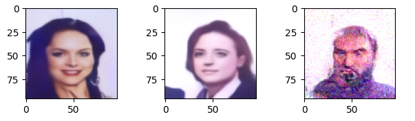

# DENOISING DIFFUSION IMPLICIT MODELS (DDIM) 

从DDPM中我们知道，其扩散过程(前向过程、或加噪过程)被定义为一个马尔可夫过程，其去噪过程(也有叫逆向过程)也是一个马尔可夫过程。对马尔可夫假设的依赖，导致重建每一步都需要依赖上一步的状态，所以推理需要较多的步长。

$$
q(x_t|x_{t-1}) := \mathcal{N}(x_t;\sqrt{\alpha_t}x_{t-1},{1-\alpha_t}I) \\
q(x_t|x_{0}) := \mathcal{N}(x_t;\sqrt{\bar{\alpha}_t}x_{0},{(1-\bar{\alpha}_t})I)
$$
$$
\begin{align*}
  q(x_{t-1}|x_t,x_0) 
&\overset{Bayes}{=} \dfrac{q(x_t|x_{t-1},x_0)q(x_{t-1}|x_0)}{q(x_t|x_0)}  \\
&\overset{Markov}{=} \dfrac{q(x_t|x_{t-1})q(x_{t-1}|x_0)}{q(x_t|x_0)}
\end{align*}
$$

DDPM中对于其逆向分布的建模使用马尔可夫假设，这样做的目的是将式子中的未知项 $q(x_t|x_{t-1},x_0)$，转化成了已知项 $q(x_t|x_{t-1})$，最后求出 $q(x_{t-1}|x_t,x_0)$ 的分布也是一个高斯分布 $\mathcal{N}(x_{t-1};\mu_q(x_t,x_0),\Sigma_q(t))$。

从DDPM的结论出发，我们不妨直接假设 $q(x_{t-1}|x_t,x_0)$ 的分布为高斯分布，在不使用马尔可夫假设的情况下，尝试求解 $q(x_{t-1}|x_t,x_0)$ 。  

由 DDPM 中 $q(x_{t-1}|x_t,x_0)$ 的分布 $\mathcal{N}(x_{t-1};\mu_q(x_t,x_0),\Sigma_q(t))$ 可知，均值为 一个关于 $x_t,x_0$ 的函数，方差为一个关于 $t$ 的函数。  

我们可以把 $q(x_{t-1}|x_t,x_0)$ 设计成如下分布：  
$$q(x_{t-1}|x_t,x_0) := \mathcal{N}(x_{t-1};  a x_0 + b x_t,\sigma_t^2 I)$$  
这样，只要求解出 $a,b,\sigma_t$ 这三个待定系数，即可确定 $q(x_{t-1}|x_t,x_0)$ 的分布。  
重参数化 $q(x_{t-1}|x_t,x_0)$ ：
$$x_{t-1}=a x_0 + b x_t + \sigma_t \varepsilon^{\prime}_{t-1}$$  
假设训练模型时输入噪声图片的加噪参数与DDPM完全一致  
由 $q(x_t|x_{0}) := \mathcal{N}(x_t;\sqrt{\bar{\alpha}_t}x_{0},(1-\bar{\alpha}_t)I)$ ：
$$x_t=\sqrt{\bar{\alpha}_t}x_{0}+\sqrt{1-\bar{\alpha}_t}\varepsilon^{\prime}_{t}$$
代入 $x_t$ 有：  
$$\begin{align*}
  x_{t-1} &=a x_0 + b(\sqrt{\bar{\alpha}_t}x_{0}+\sqrt{1-\bar{\alpha}_t}\varepsilon^{\prime}_{t}) + \sigma_t \varepsilon^{\prime}_{t-1} \\
&= (a + b\sqrt{\bar{\alpha}_t}) x_0 + (b\sqrt{1-\bar{\alpha}_t}\varepsilon^{\prime}_{t} + \sigma_t \varepsilon^{\prime}_{t-1}) \\
&= (a + b\sqrt{\bar{\alpha}_t}) x_0 + (\sqrt{b^2(1-\bar{\alpha}_t)+ \sigma_t^2}) \bar{\varepsilon}_{t-1}
\end{align*}

$$
又：
$$
x_{t-1}=\sqrt{\bar{\alpha}_{t-1}} x_0 + \sqrt{1-\bar{\alpha}_{t-1}} \varepsilon^{\prime}_{t-1}
$$
观察系数可以得到方程组：  
$$\begin{cases}
  a + b\sqrt{\bar{\alpha}_t} = \sqrt{\bar{\alpha}_{t-1}} \\
  \sqrt{b^2(1-\bar{\alpha}_t)+ \sigma_t^2} = \sqrt{1-\bar{\alpha}_{t-1}}
\end{cases}
$$
三个未知数 两个方程，可以用 $\sigma_t$ 表示 $a,b$：  
$$
\begin{cases}
  a = \sqrt{\bar{\alpha}_{t-1}} - \sqrt{\bar{\alpha}_t} \sqrt{\dfrac{1-\bar{\alpha}_{t-1}-\sigma_t^2}{1-\bar{\alpha}_t}} \\
  b = \sqrt{\dfrac{1-\bar{\alpha}_{t-1}-\sigma_t^2}{1-\bar{\alpha}_t}}
\end{cases}
$$
$a, b$ 代入 $q(x_{t-1}|x_t,x_0) := \mathcal{N}(x_{t-1};  a x_0 + b x_t,\sigma_t^2 I)$ 

$$q(x_{t-1}|x_t,x_0) := \mathcal{N}(x_{t-1}; \underbrace{ \left( \sqrt{\bar{\alpha}_{t-1}} - \sqrt{\bar{\alpha}_t} \sqrt{\dfrac{1-\bar{\alpha}_{t-1}-\sigma_t^2}{1-\bar{\alpha}_t}}\right ) x_0 + (\sqrt{\dfrac{1-\bar{\alpha}_{t-1}-\sigma_t^2}{1-\bar{\alpha}_t}}) x_t}_{\mu_q(x_t,x_0,t)},\sigma_t^2 I)
$$

又

$$
x_t=\sqrt{\bar{\alpha}_t} x_0 + \sqrt{1-\bar{\alpha}_t} \bar{\varepsilon}_0 \\
x_0 = \dfrac{1}{\sqrt{\bar{\alpha}_t}}x_t - \dfrac{\sqrt{1-\bar{\alpha}_t}}{\sqrt{\bar{\alpha}_t}} \bar{\varepsilon}_0 \\
$$
代入 $x_0$ 有：  
$$\mu_q(x_t,x_0,t) = \sqrt{\bar{\alpha}_{t-1}} \dfrac{x_t-\sqrt{1-\bar{\alpha}_t} \bar{\varepsilon}_0}{\sqrt{\bar{\alpha}_{t}}} + \sqrt{1-\bar{\alpha}_{t-1}-\sigma_t^2} \bar{\varepsilon}_0  \\
$$

$$
\begin{align*}
  x_{t-1} &= \mu_q(x_t,x_0,t) + \sigma_t \varepsilon_0 \\
&= \sqrt{\bar{\alpha}_{t-1}} \underbrace{\dfrac{x_t-\sqrt{1-\bar{\alpha}_t} \bar{\varepsilon}_0}{\sqrt{\bar{\alpha}_{t}}}}_{预测的x_0}  + \underbrace{\sqrt{1-\bar{\alpha}_{t-1}-\sigma_t^2} \bar{\varepsilon}_0}_{x_t的方向} + \underbrace{\sigma_t \varepsilon_0}_{随机噪声扰动} 
\end{align*}

$$

通过观察 $x_{t-1}$ 的分布，我们建模采样分布为高斯分布：  
$$p_\theta(x_{t-1}|x_t):=\mathcal{N}(x_{t-1};\mu_\theta(x_t,t), \Sigma_\theta(x_t,t)I)$$
并且均值和方差也采用相似的形式：  
$$
\begin{align*}
  \mu_\theta(x_t,t) &= \sqrt{\bar{\alpha}_{t-1}} \dfrac{x_t-\sqrt{1-\bar{\alpha}_t} \epsilon_\theta(x_t,t) }{\sqrt{\bar{\alpha}_{t}}} + \sqrt{1-\bar{\alpha}_{t-1}-\sigma_t^2} \epsilon_\theta(x_t,t) \\
\Sigma_\theta(x_t,t) &= \sigma_t^2
\end{align*}
$$
其中 $\epsilon_\theta(x_t,t)$ 为预测的噪声。

此时，确定优化目标只需要 $q(x_{t-1}|x_t,x_0)$ 和 $p_\theta(x_{t-1}|x_t)$ 两个分布尽可能相似，使用KL散度来度量，则有：  
$$
\begin{align*}
  &\quad \  \underset{\theta}{argmin} D_{KL}(q(x_{t-1}|x_t,x_0)||p_\theta(x_{t-1}|x_t)) \\
&=\underset{\theta}{argmin} D_{KL}(\mathcal{N}(x_{t-1};\mu_q, \Sigma_q(t))||\mathcal{N}(x_{t-1};\mu_\theta, \Sigma_q(t))) \\
&=\underset{\theta}{argmin} \dfrac{1}{2} \left[ log\dfrac{|\Sigma_q(t)|}{|\Sigma_q(t)|} - k + tr(\Sigma_q(t)^{-1}\Sigma_q(t)) + (\mu_q-\mu_\theta)^T \Sigma_q(t)^{-1} (\mu_q-\mu_\theta) \right] \\
&=\underset{\theta}{argmin} \dfrac{1}{2} \left[ 0 - k + k + (\mu_q-\mu_\theta)^T (\sigma_t^2I)^{-1} (\mu_q-\mu_\theta) \right] \\
&\overset{内积公式A^TA}{=} \underset{\theta}{argmin} \dfrac{1}{2\sigma_t^2} \left[ ||\mu_q-\mu_\theta||_2^2 \right] \\
&\overset{代入\mu_q,\mu_\theta}{=} \underset{\theta}{argmin} \dfrac{1}{2\sigma_t^2} (\sqrt{1-\bar{\alpha}_{t-1}-\sigma_t^2} - \dfrac{\sqrt{\bar{\alpha}_{t-1}} \sqrt{1-\bar{\alpha}_t}}{\sqrt{\bar{\alpha}_t}}) \left[ ||\bar{\varepsilon}_0-\epsilon_\theta(x_t,t)||_2^2 \right] 
\end{align*}
$$

恰好与DDPM的优化目标一致，所以我们可以直接复用DDPM训练好的模型。

$p_{\theta}$ 的采样步骤则为：
$$
x_{t-1} = \sqrt{\bar{\alpha}_{t-1}} \underbrace{\dfrac{x_t-\sqrt{1-\bar{\alpha}_t} \epsilon_\theta(x_t,t)}{\sqrt{\bar{\alpha}_{t}}}}_{预测的x_0}  + \underbrace{\sqrt{1-\bar{\alpha}_{t-1}-\sigma_t^2} \epsilon_\theta(x_t,t)}_{x_t的方向} + \underbrace{\sigma_t \varepsilon}_{随机噪声扰动} 
$$

令 $\sigma_t=\eta \sqrt{\dfrac{(1-{\alpha}_{t})(1-\bar{\alpha}_{t-1})}{1-\bar{\alpha}_{t}}}$

当 $\eta =1$ 时，前向过程为 Markovian ，采样过程变为 DDPM 。

当 $\eta =0$ 时，采样过程为确定过程，此时的模型 称为 隐概率模型(implicit probabilstic model)。

DDIM如何加速采样：  
在 DDPM 中，基于马尔可夫链 $t$ 与 $t-1$ 是相邻关系，例如 $t=100$ 则 $t-1=99$；  
在 DDIM 中，$t$ 与 $t-1$ 只表示前后关系，例如 $t=100$ 时，$t-1$ 可以是 90 也可以是 80、70，只需保证 $t-1 < t$ 即可。  
此时构建的采样子序列 $\tau=[\tau_i,\tau_{i-1},\cdots,\tau_{1}] \ll [t,t-1,\cdots,1]$ 。  
例如，原序列 $\Tau=[100,99,98,\cdots,1]$，采样子序列为 $\tau=[100,90,80,\cdots,1]$ 。

DDIM 采样公式为：
$$
x_{\tau_{i-1}} = \sqrt{\bar{\alpha}_{\tau_{i-1}}} {\dfrac{x_{\tau_{i}}-\sqrt{1-\bar{\alpha}_{\tau_{i}}} \epsilon_\theta(x_{\tau_{i}},{\tau_{i}})}{\sqrt{\bar{\alpha}_{\tau_{i}}}}}  + {\sqrt{1-\bar{\alpha}_{\tau_{i-1}}-\sigma_{\tau_{i}}^2} \epsilon_\theta(x_{\tau_{i}},{\tau_{i}})} + {\sigma_{\tau_{i}} \varepsilon} 
$$


当 $\eta= 0$ 时，DDIM 采样公式为：  
$$ x_{\tau_{i-1}} = \dfrac{\sqrt{\bar{\alpha}_{\tau_{i-1}}}}{\sqrt{\bar{\alpha}_{\tau_{i}}}} x_{\tau_{i}} + \left( \sqrt{1-\bar{\alpha}_{\tau_{i-1}}} - \dfrac{\sqrt{\bar{\alpha}_{\tau_{i-1}}}}{\sqrt{\bar{\alpha}_{\tau_{i}}}} \sqrt{1-\bar{\alpha}_{\tau_{i}}} \right) \epsilon_\theta(x_{\tau_i},\tau_i)
$$

### 代码实现

训练过程与 DDPM 一致，代码参考上一篇文章。采样代码如下：  

```py
device = 'cuda'
torch.cuda.empty_cache()
model = Unet().to(device)
model.load_state_dict(torch.load('ddpm_T1000_l2_epochs_300.pth'))
model.eval()

image_size=96
epochs = 500
batch_size = 128
T=1000
betas = torch.linspace(0.0001, 0.02, T).to('cuda') # torch.Size([1000])

# 每隔20采样一次
tau_index = list(reversed(range(0, T, 20))) #[980, 960, ..., 20, 0]
eta = 0.003

# print(tau_index)

# train
alphas = 1 - betas # 0.9999 -> 0.98
alphas_cumprod = torch.cumprod(alphas, axis=0) # 0.9999 -> 0.0000
sqrt_alphas_cumprod = torch.sqrt(alphas_cumprod)
sqrt_one_minus_alphas_cumprod = torch.sqrt(1-alphas_cumprod)

def get_val_by_index(val, t, x_shape):
    batch_t = t.shape[0]
    out = val.gather(-1, t)
    return out.reshape(batch_t, *((1,) * (len(x_shape) - 1))) # torch.Size([batch_t, 1, 1, 1])

def p_sample_ddim(model):
    def step_denoise(model, x_tau_i, tau_i, tau_i_1):
        sqrt_alphas_bar_tau_i = get_val_by_index(sqrt_alphas_cumprod, tau_i, x_tau_i.shape)
        sqrt_alphas_bar_tau_i_1 = get_val_by_index(sqrt_alphas_cumprod, tau_i_1, x_tau_i.shape)

        denoise = model(x_tau_i, tau_i)
        
        if eta == 0:
            sqrt_1_minus_alphas_bar_tau_i = get_val_by_index(sqrt_one_minus_alphas_cumprod, tau_i, x_tau_i.shape)
            sqrt_1_minus_alphas_bar_tau_i_1 = get_val_by_index(sqrt_one_minus_alphas_cumprod, tau_i_1, x_tau_i.shape)
            x_tau_i_1 = sqrt_alphas_bar_tau_i_1 / sqrt_alphas_bar_tau_i * x_tau_i \
                + (sqrt_1_minus_alphas_bar_tau_i_1 - sqrt_alphas_bar_tau_i_1 / sqrt_alphas_bar_tau_i * sqrt_1_minus_alphas_bar_tau_i) \
                * denoise            
            return x_tau_i_1

        sigma = eta * torch.sqrt((1-get_val_by_index(alphas, tau_i, x_tau_i.shape)) * \
        (1-get_val_by_index(sqrt_alphas_cumprod, tau_i_1, x_tau_i.shape)) / get_val_by_index(sqrt_one_minus_alphas_cumprod, tau_i, x_tau_i.shape))
        
        noise_z = torch.randn_like(x_tau_i, device=x_tau_i.device)
        
        # 整个式子由三部分组成
        c1 = sqrt_alphas_bar_tau_i_1 / sqrt_alphas_bar_tau_i * (x_tau_i - get_val_by_index(sqrt_one_minus_alphas_cumprod, tau_i, x_tau_i.shape) * denoise)  
        c2 = torch.sqrt(1 - get_val_by_index(alphas_cumprod, tau_i_1, x_tau_i.shape) - sigma) * denoise
        c3 = sigma * noise_z
        x_tau_i_1 = c1 + c2 + c3

        return x_tau_i_1

    
    img_pred = torch.randn((4, 3, image_size, image_size), device=device)

    for k in range(0, len(tau_index)):
        # print(tau_index)
        # 因为 tau_index 是倒序的，tau_i = k, tau_i_1 = k+1，这里不能弄反
        tau_i_1 = torch.tensor([tau_index[k+1]], device=device, dtype=torch.long)
        tau_i = torch.tensor([tau_index[k]], device=device, dtype=torch.long)
        img_pred = step_denoise(model, img_pred, tau_i, tau_i_1)
        
        # if k % 20 == 0:
        #     img_pred = torch.clamp(img_pred, -3.0, 3.0)
        torch.cuda.empty_cache()
        if tau_index[k+1] == 0: return img_pred

    return img_pred

with torch.no_grad():
    img = p_sample_ddim(model)
    img = torch.clamp(img, -1.0, 1.0)

show_img_batch(img.detach().cpu())
```



DDIM  
https://arxiv.org/pdf/2010.02502  
https://github.com/ermongroup/ddim  