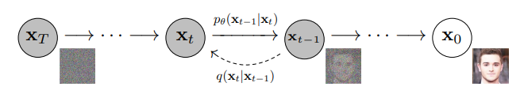
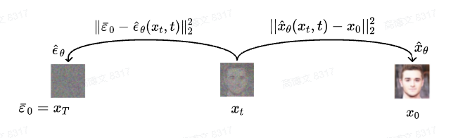
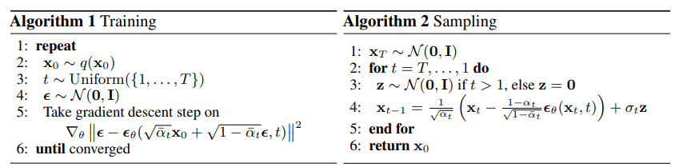

# Denoising Diffusion Probabilistic Model(DDPM)原理

### 1. 生成模型对比
记 真实图片为 $x_0$，噪声图片为 $x_t$，噪声变量 $z\sim \mathcal{N}(\mu,\sigma^2)$，噪声变量 $\varepsilon \sim \mathcal{N}(0,I)$，编码过程 $q$，解码过程 $p$。

#### GAN网络
$$z\xrightarrow{p} \hat{x}_0 $$
#### VAE网络
$$x_0 \xrightarrow{q} \mu+\sigma \varepsilon =z \xrightarrow{p} \hat{x}_0$$
#### Diffusion网络  
加噪编码：
$$x_0 \xrightarrow{q} x_{1} \xrightarrow{q} \cdots \xrightarrow{q} x_{t-1} \xrightarrow{q} x_t = z$$
去噪解码：  
$$z=x_t \xrightarrow{p} x_{t-1} \xrightarrow{p} \cdots \xrightarrow{p} x_{1} \xrightarrow{p} \hat{x}_0$$

DDPM加噪过程分成了 t 步，每次只加入少量噪声，同样的去噪过程也分为t步，使得模型更容易学习，生成效果更稳定。

## 2. 原理解析
### 2.1 加噪过程
$$x_0 \xrightarrow{q} x_{1} \xrightarrow{q} \cdots \xrightarrow{q} x_{t-1} \xrightarrow{q} x_t = z$$

此过程中，时刻t时图片 $x_t$ 只依赖于上一时刻图片 $x_{t-1}$，故 将整个加噪过程建模成马尔可夫过程，则有 
$$q(x_1,\cdots,x_T|x_0) \coloneqq \prod \limits_{t=1}^{T}q(x_t|x_{t-1})$$
对于单个加噪过程，希望每次加入的噪声比较小，时间相邻的图片差异不要太大。  
设加入噪声$\sqrt{\beta_t}\varepsilon_t \sim \mathcal{N}(0,\beta_tI),\quad \varepsilon_t \sim \mathcal{N}(0,I), \beta_t \to 0^+$ ：  
$$x_t=k_tx_{t-1}+\sqrt{\beta_t}\varepsilon_t$$
由 $x_t=\mu_t + \sigma_t \varepsilon$ （重参数化）可知，$x_t$ 的均值为 $k_t x_{t-1}$，方差为 $\beta_t$ ，
其PDF定义为:  
$$q(x_t|x_{t-1}) := \mathcal{N}(x_t;k_t x_{t-1},{\beta_t}I)$$
把 $x_t$ 展开: 
$$
x_t=k_tx_{t-1}+\sqrt{\beta_t}\varepsilon_t \\
= k_t (k_{t-1} x_{t-2}+\sqrt{\beta_{t-1}}\varepsilon_{t-1})+\sqrt{\beta_t}\varepsilon_t \\
= k_t k_{t-1} x_{t-2} + (k_t\sqrt{\beta_{t-1}}\varepsilon_{t-1} +\sqrt{\beta_t}\varepsilon_t) \\
= \underbrace{k_t k_{t-1}\cdots k_1 x_0}_{\mu_t}  + \underbrace{ ((k_tk_{t-1}\cdots k_2) \sqrt{\beta_{1}}\varepsilon_1+ \cdots  +k_t\sqrt{\beta_{t-1}}\varepsilon_{t-1} +\sqrt{\beta_t}\varepsilon_t)}_{\sigma_t \varepsilon}
$$

根据 $X+Y \sim \mathcal{N}(\mu_1+\mu_2, \sigma_1^2 + \sigma_2^2)$ 有 $x_t$的方差：
$$ \sigma_t^2 = (k_t k_{t-1}\cdots k_1)^2 + (k_tk_{t-1}\cdots k_2)^2 \beta_{1} + \cdots + k_t^2\beta_{t-1} + \beta_t$$

希望最后一次加噪后的$x_t$为$\mathcal{N}(0,I)$分布纯噪声，即 $\sigma_t^2 =1$。解得 $\beta_t=1-k_t^2$，即 $k_t=\sqrt{1-\beta_t}, 0<k_t<1$，此时的均值 $\mu_t= k_t k_{t-1}\cdots k_1 x_0$ 恰好也收敛于 0 。

$$
\begin{align*}
  x_t &=\sqrt{1-\beta_t}x_{t-1}+\sqrt{\beta_t}\varepsilon_t \\ 
q(x_t|x_{t-1}) &:= \mathcal{N}(x_t;\sqrt{1-\beta_t}x_{t-1},{\beta_t}I)
\end{align*}
$$  
令 $k_t=\sqrt{\alpha_t}=\sqrt{1-\beta_t}$，则有 $\alpha_t + \beta_t =1$。
$$
\begin{align*}
q(x_t|x_{t-1}) &:= \mathcal{N}(x_t;\sqrt{\alpha_t}x_{t-1},{1-\alpha_t}I) \tag{1} \\
\end{align*}
$$
$$x_t=\sqrt{\alpha_t}x_{t-1}+\sqrt{1-\alpha_t}\varepsilon_t \\
= \sqrt{\alpha_t \alpha_{t-1}\cdots \alpha_1} x_0 + (\sqrt{\alpha_t \alpha_{t-1}\cdots \alpha_2} \sqrt{1-\alpha_{1}}\varepsilon_1+ \cdots  +\sqrt{\alpha_t} \sqrt{1-\alpha_{t-1}}\varepsilon_{t-1} +\sqrt{1-\alpha_t}\varepsilon_t) \\
$$
又 $x_t \sim \mathcal{N}(0,I)$, 所以形式上等价于:  
$$x_t=\sqrt{\alpha_t \alpha_{t-1}\cdots \alpha_1} x_0 + \sqrt{1-(\alpha_t \alpha_{t-1}\cdots \alpha_1)} \bar{\varepsilon}_0
$$

令 $\bar{\alpha}_t=\alpha_t \alpha_{t-1}\cdots \alpha_1=\prod_{i=1}^t \alpha_i$，有  
$$x_t=\sqrt{\bar{\alpha}_t} x_0 + \sqrt{1-\bar{\alpha}_t} \bar{\varepsilon}_0 \\
q(x_t|x_{0}) := \mathcal{N}(x_t;\sqrt{\bar{\alpha}_t}x_{0},{(1-\bar{\alpha}_t})I) \tag{2}
$$
其中 $\bar{\varepsilon} \sim \mathcal{N}(0,I)$ 为纯噪声，$\bar{\alpha}_t$ 控制每步掺入噪声的强度，可以设置为超参数。故 整个加噪过程是确定的，不需要模型学习，相当于给每步时间 t 制作的了一份可供模型学习的样本标签数据。公式 (1) 描述局部过程分布，公式 (2) 描述整体过程分布。

### 2.2 去噪解码
$$z=x_t \xrightarrow{p} x_{t-1} \xrightarrow{p} \cdots \xrightarrow{p} x_{1} \xrightarrow{p} \hat{x}_0$$

设，神经网络的完整去噪过程为 $p_\theta(x_{0}|x_t)$，由马尔科夫链有
$$p_\theta(x_{0}|x_t):= p_\theta(x_t) \prod_{t=1}p_\theta(x_{t-1}|x_t)$$  
对于单步去噪的分布则定义为
$$p_\theta(x_{t-1}|x_t):=\mathcal{N}(x_{t-1};\mu_\theta(x_t,t), \Sigma_\theta(x_t,t))$$
其中 均值 $\mu_\theta$ 和 协方差 $\Sigma_\theta$（暂定）需要模型去学习得到。  
 
如何从每步加噪 $q(x_t|x_{t-1})$ 中，学习去噪的知识呢？我们先观察一下其逆过程 $q(x_{t-1}|x_t)$ 的分布形式。  
高斯分布：
$$
\begin{aligned}
p(x) &= \dfrac{1}{\sqrt{2\pi\sigma^{2}}} \exp \left ({-\dfrac{1}{2}(\dfrac{x-\mu}{\sigma})^{2}} \right)  \\
&= \frac{1}{\sqrt{2\pi\sigma^2} } \exp \left[ -\frac{1}{2\sigma^2} \left( x^2 - 2\mu x + \mu^2  \right )  \right] 
\end{aligned}
$$
$$
\begin{align*}

q(x_{t-1}|x_t)&\overset{Markov}{=}q(x_{t-1}|x_t,x_0)\overset{Bayes}{=}\dfrac{q(x_t|x_{t-1},x_0)q(x_{t-1}|x_0)}{q(x_t|x_0)} \\

&\overset{公式(1)(2)}{=} \dfrac{\mathcal{N}(x_{t};\sqrt{{\alpha}_t}x_{t-1},{(1-{\alpha}_t})I)  \mathcal{N}(x_{t-1};\sqrt{\bar{\alpha}_{t-1}}x_{0},{(1-\bar{\alpha}_{t-1}})I)}{\mathcal{N}(x_t;\sqrt{\bar{\alpha}_t}x_{0},(1-\bar{\alpha}_t)I)} \\

&\overset{Gaussian}{\propto} \exp \left \{ - \dfrac{1}{2} \left[ \dfrac{(x_t - \sqrt{\alpha_t}x_{t-1})^2}{1-\alpha_t} + \dfrac{(x_{t-1} - \sqrt{\bar{\alpha}_{t-1}}x_{0})^2}{1-\bar{\alpha}_{t-1}} -\dfrac{(x_{t} - \sqrt{\bar{\alpha}_t}x_{0})^2}{1-\bar{\alpha}_t} \right]  \right\} \\

&\overset{通分配方}{=}\exp \left \{ - \dfrac{1}{2} \left( 1/ \dfrac{(1-{\alpha}_{t})(1-\bar{\alpha}_{t-1})}{1-\bar{\alpha}_{t}}  \right) \left[x_{t-1}^2 - 2 \dfrac{\sqrt{\alpha_t}(1-\bar{\alpha}_{t-1})x_t + \sqrt{\bar{\alpha}_{t-1}}(1-\alpha_{t})x_0}{1-\bar{\alpha}_{t}} x_{t-1} + C(x_t,x_0) \right]  \right \} \\

&\overset{C(x_t,x_0)为常数}{\propto} \mathcal{N}(x_{t-1};\underbrace{\dfrac{\sqrt{\alpha_t}(1-\bar{\alpha}_{t-1})x_t + \sqrt{\bar{\alpha}_{t-1}}(1-\alpha_{t})x_0}{1-\bar{\alpha}_{t}}}_{\mu_q(x_t,x_0)}, \underbrace{\dfrac{(1-{\alpha}_{t})(1-\bar{\alpha}_{t-1})}{1-\bar{\alpha}_{t}}I}_{\Sigma_q(t)})
\end{align*}
$$
由此可知 $q(x_{t-1}|x_t)$ 服从高斯分布 $\mathcal{N}(x_{t-1};\mu_q(x_t,x_0),\Sigma_q(t))$ , 其中 均值$\mu_q(x_t,x_0)$可以看作是只与 $x_0$ 有关的函数，$\Sigma_q(t)=\sigma_q^2(t)I$ 只与时间步 t 有关，可以看作常数，令 $\Sigma_\theta(x_t,t)=\Sigma_q(t)$ 即可。   

此时，确定优化目标只需要 $q(x_{t-1}|x_t)$ 和 $p_\theta(x_{t-1}|x_t)$ 两个分布尽可能相似即可，即最小化两个分布的KL散度来度量。  
两个高斯分布的KL散度公式：
$$KL(\mathcal{N}(\mu_1, \sigma_1^{2})||\mathcal{N}(\mu_2, \sigma_2^{2}))=\dfrac{1}{2}\bigg[log\dfrac{|\Sigma_2|}{|\Sigma_1|} -k +tr(\Sigma_2^{-1}\Sigma_1)+(\mu_1-\mu_2)^T\Sigma_2^{-1}(\mu_1-\mu_2) \bigg]
$$
代入公式  
$$ \begin{align*}
&\quad \  \underset{\theta}{argmin} D_{KL}(q(x_{t-1}|x_t)||p_\theta(x_{t-1}|x_t)) \\
&=\underset{\theta}{argmin} D_{KL}(\mathcal{N}(x_{t-1};\mu_q, \Sigma_q(t))||\mathcal{N}(x_{t-1};\mu_\theta, \Sigma_q(t))) \\
&=\underset{\theta}{argmin} \dfrac{1}{2} \left[ log\dfrac{|\Sigma_q(t)|}{|\Sigma_q(t)|} - k + tr(\Sigma_q(t)^{-1}\Sigma_q(t)) + (\mu_q-\mu_\theta)^T \Sigma_q(t)^{-1} (\mu_q-\mu_\theta) \right] \\
&=\underset{\theta}{argmin} \dfrac{1}{2} \left[ 0 - k + k + (\mu_q-\mu_\theta)^T (\sigma_q^2(t)I)^{-1} (\mu_q-\mu_\theta) \right] \\
&\overset{内积公式A^TA}{=} \underset{\theta}{argmin} \dfrac{1}{2\sigma_q^2(t)} \left[ ||\mu_q-\mu_\theta||_2^2 \right]
\end{align*}
$$
可知，只要两个分布的均值 $\mu_q(x_t,x_0)$ $\mu_\theta(x_t,t)$ 相近即可。又：
$$
\mu_q(x_t,x_0)=\dfrac{\sqrt{\alpha_t}(1-\bar{\alpha}_{t-1})x_t + \sqrt{\bar{\alpha}_{t-1}}(1-\alpha_{t})x_0}{1-\bar{\alpha}_{t}}
$$
所以，相似的可以把 $\mu_\theta(x_t,t)$ 设计成如下形式：
$$
\mu_\theta(x_t,t)=\dfrac{\sqrt{\alpha_t}(1-\bar{\alpha}_{t-1})x_t + \sqrt{\bar{\alpha}_{t-1}}(1-\alpha_{t})\hat{x}_\theta(x_t,t)}{1-\bar{\alpha}_{t}}
$$
代入 $\mu_q(x_t,x_0)$ $\mu_\theta(x_t,t)$ 可得：
$$
\begin{align*}
& \quad \underset{\theta}{argmin} \dfrac{1}{2\sigma_q^2(t)} \left[ ||\mu_q-\mu_\theta||_2^2 \right] \\
&= \underset{\theta}{argmin} \dfrac{1}{2\sigma_q^2(t)} \dfrac{{\bar{\alpha}_{t-1}} (1-\alpha_{t})^2}{(1-\bar{\alpha}_{t})^2} \left[ ||\hat{x}_\theta(x_t,t)-x_0||_2^2 \right] \\
&\overset{代入\sigma_q^2(t)}{=} \underset{\theta}{argmin} \dfrac{1}{2} \left( \dfrac{\bar{\alpha}_{t-1}}{1-\bar{\alpha}_{t-1}} - \dfrac{\bar{\alpha}_{t}}{1-\bar{\alpha}_{t}} \right) \left[ ||\hat{x}_\theta(x_t,t)-x_0||_2^2 \right]
\end{align*}
$$
至此， $\underset{\theta}{argmin} D_{KL}(q(x_{t-1}|x_t)||p_\theta(x_{t-1}|x_t))$ 的问题，被转化成了通过给定 $(x_t,t)$ 让模型预测图片 $\hat{x}_\theta(x_t,t)$ 对比 真实图片 $x_0$ 的问题 (Dalle2的训练采用此方式)。  
然而，后续研究发现通过噪声直接预测图片的训练效果不太理想，DDPM通过重参数化把对图片的预测转化成对噪声的预测，获得了更好的实验效果。
$$
x_t=\sqrt{\bar{\alpha}_t} x_0 + \sqrt{1-\bar{\alpha}_t} \bar{\varepsilon}_0 \\
x_0 = \dfrac{1}{\sqrt{\bar{\alpha}_t}}x_t - \dfrac{\sqrt{1-\bar{\alpha}_t}}{\sqrt{\bar{\alpha}_t}}\bar{\varepsilon}_0 \\
$$
$$图片x_0=噪声x_t - 噪声\bar{\varepsilon}_0$$
$\mu_q(x_t,x_0)$ 代入 $x_0$
$$
\mu_q(x_t,x_0)=\dfrac{\sqrt{\alpha_t}(1-\bar{\alpha}_{t-1})x_t + \sqrt{\bar{\alpha}_{t-1}}(1-\alpha_{t})x_0}{1-\bar{\alpha}_{t}} \\
= \dfrac{1}{\sqrt{{\alpha}_t}}x_t - \dfrac{1-{\alpha}_{t}}{\sqrt{1-\bar{\alpha}_t}\sqrt{\alpha_t}}\bar{\varepsilon}_0
$$
同理，$\mu_\theta(x_t,t)$ 也设计成相近的形式：
$$\mu_\theta(x_t,t) = \dfrac{1}{\sqrt{{\alpha}_t}}x_t - \dfrac{1-{\alpha}_{t}}{\sqrt{1-\bar{\alpha}_t}\sqrt{\alpha_t}}\hat{\epsilon}_\theta(x_t,t)
$$
计算此时的KL散度：
$$\begin{align*}
&\quad \  \underset{\theta}{argmin} D_{KL}(q(x_{t-1}|x_t)||p_\theta(x_{t-1}|x_t)) \\
&=\underset{\theta}{argmin} D_{KL}(\mathcal{N}(x_{t-1};\mu_q, \Sigma_q(t))||\mathcal{N}(x_{t-1};\mu_\theta, \Sigma_q(t))) \\

&= \underset{\theta}{argmin} \dfrac{1}{2\sigma_q^2(t)} \left[ \Vert \mu_q(x_t,x_0) - \mu_\theta(x_t,t) \Vert _2^2 \right] \\

&= \underset{\theta}{argmin} \dfrac{1}{2\sigma_q^2(t)} \left[ \left \Vert \dfrac{1}{\sqrt{{\alpha}_t}}x_t - \dfrac{1-{\alpha}_{t}}{\sqrt{1-\bar{\alpha}_t}\sqrt{\alpha_t}}\bar{\varepsilon}_0 - (\dfrac{1}{\sqrt{{\alpha}_t}}x_t - \dfrac{1-{\alpha}_{t}}{\sqrt{1-\bar{\alpha}_t}\sqrt{\alpha_t}}\hat{\epsilon}_\theta(x_t,t)) \right \Vert _2^2 \right] \\

&=\underset{\theta}{argmin} \dfrac{1}{2} \left( \dfrac{\bar{\alpha}_{t-1}}{1-\bar{\alpha}_{t-1}} - \dfrac{\bar{\alpha}_{t}}{1-\bar{\alpha}_{t}} \right) \left[ \Vert \bar{\varepsilon}_0 - \hat{\epsilon}_\theta(x_t,t) \Vert_2^2 \right] \\

&\overset{代入x_t}{=} \underset{\theta}{argmin} \dfrac{1}{2} \left( \dfrac{\bar{\alpha}_{t-1}}{1-\bar{\alpha}_{t-1}} - \dfrac{\bar{\alpha}_{t}}{1-\bar{\alpha}_{t}} \right) \left[ \Vert \bar{\varepsilon}_0 - \hat{\epsilon}_\theta(\sqrt{\bar{\alpha}_t} x_0 + \sqrt{1-\bar{\alpha}_t} \bar{\varepsilon}_0,t) \Vert_2^2 \right] \\
&
\end{align*}
$$

由此可见，这两种方法在本质上是等价的，$\Vert \bar{\varepsilon}_0 - \hat{\epsilon}_\theta(x_t,t) \Vert_2^2$ 更关注对加入的噪声的预测。  
通俗的解释：给模型 一张加过噪的图片 和 时间步，让模型预测出最初的纯噪声长什么样子。

$$
$$

对于整个过程损失只需每步的损失都是最小即可：$min\ L_{simple} = \mathbb{E}_{t\sim U\{2,T\}}\underset{\theta}{argmin}[\Vert \bar{\varepsilon}_0 - \hat{\epsilon}_\theta(x_t,t) \Vert_2^2]$。  

##### 2.2.1 模型推理的采样过程

由模型的单步去噪的分布定义：
$$p_\theta(x_{t-1}|x_t):=\mathcal{N}(x_{t-1};\mu_\theta(x_t,t), \Sigma_\theta(x_t,t))$$
重参数化，代入 $\mu_\theta$ $\Sigma_\theta$：
$$\begin{align*}
  

x_{t-1} &= \mu_\theta(x_t,t) + \sqrt{\Sigma_\theta(x_t,t)}\ \mathrm{z},\quad \mathrm{z}\sim\mathcal{N}(0,I) \\
 &= \left(\dfrac{1}{\sqrt{{\alpha}_t}}x_t - \dfrac{1-{\alpha}_{t}}{\sqrt{1-\bar{\alpha}_t}\sqrt{\alpha_t}}\hat{\epsilon}_\theta(x_t,t) \right) + \sigma_q(t) \mathrm{z} \\
&= \dfrac{1}{\sqrt{{\alpha}_t}}\left( x_t - \dfrac{1-{\alpha}_{t}}{\sqrt{1-\bar{\alpha}_t}}\hat{\epsilon}_\theta(x_t,t) \right) + \sigma_q(t) \mathrm{z} 
\end{align*}
$$

综上，
- 训练过程：抽取图片 $x_0$ 和 噪声 $\bar{\varepsilon}_0$，循环时间步 $t\sim U\{1,\cdots,T\}$：
  - 预测噪声损失 $\Vert \bar{\varepsilon}_0 - \hat{\epsilon}_\theta(\sqrt{\bar{\alpha}_t} x_0 + \sqrt{1-\bar{\alpha}_t} \bar{\varepsilon}_0,t) \Vert_2^2$
  - 然后抽取下一张图片，重复过程，直至损失收敛。

- 推理过程：随机初始噪声图片 $x_T$，倒序循环时间步 $t\sim U\{T,\cdots,1\}$ ：
  - 用模型采样噪声 $\epsilon_\theta(x_t,t)$
  - 【噪声图片 $x_t$】-【采样噪声$\epsilon_\theta$】+【随机扰动方差噪声$\sigma_q(t) \mathrm{z}$】=【噪声图片 $x_{t-1}$】
  - 【噪声图片 $x_{t-1}$】进行处理，至 $t=1$ 时，不加扰动
  - 【噪声图片 $x_1$】-【采样噪声$\epsilon_\theta$】= 【真实图片 $x_{0}$】

参考代码

https://github.com/chunyu-li/ddpm  
https://github.com/lucidrains/denoising-diffusion-pytorch
 
参考文章

[Denoising Diffusion Probabilistic Model](https://arxiv.org/pdf/2006.11239)

[Improved Denoising Diffusion Probabilistic Models](https://arxiv.org/pdf/2102.09672)

[Understanding Diffusion Models: A Unified Perspective](https://arxiv.org/abs/2208.11970)

https://www.zhihu.com/people/ceng-yuan-16/posts

[Understanding Diffusion Models: A Unified Perspective 阅读笔记](https://zhuanlan.zhihu.com/p/558937247)

[Improved Denoising Diffusion Probabilistic Models](https://proceedings.mlr.press/v139/nichol21a/nichol21a.pdf)

