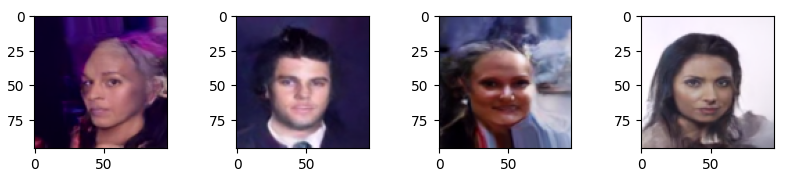

# Denoising Diffusion Probabilistic Model(DDPM)原理

### 1. 生成模型对比
记 真实图片为 $x_0$，噪声图片为 $x_t$，噪声变量 $z\sim \mathcal{N}(\mu,\sigma^2)$，噪声变量 $\varepsilon \sim \mathcal{N}(0,I)$，编码过程 $q$，解码过程 $p$。

#### GAN网络
$$z\xrightarrow{p} \hat{x}_0 $$
#### VAE网络
$$x_0 \xrightarrow{q} \mu+\sigma \varepsilon =z \xrightarrow{p} \hat{x}_0$$
#### Diffusion网络  
加噪编码：
$$x_0 \xrightarrow{q} x_{1} \xrightarrow{q} \cdots \xrightarrow{q} x_{t-1} \xrightarrow{q} x_t = z$$
去噪解码：  
$$z=x_t \xrightarrow{p} x_{t-1} \xrightarrow{p} \cdots \xrightarrow{p} x_{1} \xrightarrow{p} \hat{x}_0$$

DDPM加噪过程分成了 t 步，每次只加入少量噪声，同样的去噪过程也分为t步，使得模型更容易学习，生成效果更稳定。


## 2. 原理解析
### 2.1 加噪过程
$$x_0 \xrightarrow{q} x_{1} \xrightarrow{q} \cdots \xrightarrow{q} x_{t-1} \xrightarrow{q} x_t = z$$

此过程中，时刻t时图片 $x_t$ 只依赖于上一时刻图片 $x_{t-1}$，故 将整个加噪过程建模成马尔可夫过程，则有 
$$q(x_1,\cdots,x_T|x_0) \coloneqq \prod \limits_{t=1}^{T}q(x_t|x_{t-1})$$
对于单个加噪过程，希望每次加入的噪声比较小，时间相邻的图片差异不要太大。  
设加入噪声$\sqrt{\beta_t}\varepsilon_t \sim \mathcal{N}(0,\beta_tI),\quad \varepsilon_t \sim \mathcal{N}(0,I), \beta_t \to 0^+$ ：  
$$x_t=k_tx_{t-1}+\sqrt{\beta_t}\varepsilon_t$$
由 $x_t=\mu_t + \sigma_t \varepsilon$ （重参数化）可知，$x_t$ 的均值为 $k_t x_{t-1}$，方差为 $\beta_t$ ，
其PDF定义为:  
$$q(x_t|x_{t-1}) := \mathcal{N}(x_t;k_t x_{t-1},{\beta_t}I)$$
把 $x_t$ 展开: 
$$
x_t=k_tx_{t-1}+\sqrt{\beta_t}\varepsilon_t \\
= k_t (k_{t-1} x_{t-2}+\sqrt{\beta_{t-1}}\varepsilon_{t-1})+\sqrt{\beta_t}\varepsilon_t \\
= k_t k_{t-1} x_{t-2} + (k_t\sqrt{\beta_{t-1}}\varepsilon_{t-1} +\sqrt{\beta_t}\varepsilon_t) \\
= \underbrace{k_t k_{t-1}\cdots k_1 x_0}_{\mu_t}  + \underbrace{ ((k_tk_{t-1}\cdots k_2) \sqrt{\beta_{1}}\varepsilon_1+ \cdots  +k_t\sqrt{\beta_{t-1}}\varepsilon_{t-1} +\sqrt{\beta_t}\varepsilon_t)}_{\sigma_t \varepsilon}
$$

根据 $X+Y \sim \mathcal{N}(\mu_1+\mu_2, \sigma_1^2 + \sigma_2^2)$ 有 $x_t$的方差：
$$ \sigma_t^2 = (k_t k_{t-1}\cdots k_1)^2 + (k_tk_{t-1}\cdots k_2)^2 \beta_{1} + \cdots + k_t^2\beta_{t-1} + \beta_t$$

希望最后一次加噪后的$x_t$为$\mathcal{N}(0,I)$分布纯噪声，即 $\sigma_t^2 =1$。解得 $\beta_t=1-k_t^2$，即 $k_t=\sqrt{1-\beta_t}, 0<k_t<1$，此时的均值 $\mu_t= k_t k_{t-1}\cdots k_1 x_0$ 恰好也收敛于 0 。

$$
\begin{align*}
  x_t &=\sqrt{1-\beta_t}x_{t-1}+\sqrt{\beta_t}\varepsilon_t \\ 
q(x_t|x_{t-1}) &:= \mathcal{N}(x_t;\sqrt{1-\beta_t}x_{t-1},{\beta_t}I)
\end{align*}
$$  
令 $k_t=\sqrt{\alpha_t}=\sqrt{1-\beta_t}$，则有 $\alpha_t + \beta_t =1$。
$$
\begin{align*}
q(x_t|x_{t-1}) &:= \mathcal{N}(x_t;\sqrt{\alpha_t}x_{t-1},{1-\alpha_t}I) \tag{1} \\
\end{align*}
$$
$$
\begin{align*}
  x_t&=\sqrt{\alpha_t}x_{t-1}+\sqrt{1-\alpha_t}\varepsilon_t \\
&= \sqrt{\alpha_t}\left(\sqrt{\alpha_{t-1}}x_{t-2}+\sqrt{1-\alpha_{t-1}}\varepsilon_{t-1}\right)+\sqrt{1-\alpha_t}\varepsilon_t \\
&=\sqrt{\alpha_t \alpha_{t-1}} x_{t-2} + \left[ \sqrt{\alpha_t-\alpha_t \alpha_{t-1}} \varepsilon_{t-1} + \sqrt{1-\alpha_t}\varepsilon_t \right] \\
&=\sqrt{\alpha_t \alpha_{t-1}} x_{t-2} + \sqrt{1-(\alpha_t \alpha_{t-1})} \bar{\varepsilon}_{t-2} \\
&=\cdots \\
&=\sqrt{\alpha_t \alpha_{t-1}\cdots \alpha_1} x_0 + \sqrt{1-(\alpha_t \alpha_{t-1}\cdots \alpha_1)} \bar{\varepsilon}_0
\end{align*}

$$

令 $\bar{\alpha}_t=\alpha_t \alpha_{t-1}\cdots \alpha_1=\prod_{i=1}^t \alpha_i$，有  
$$x_t=\sqrt{\bar{\alpha}_t} x_0 + \sqrt{1-\bar{\alpha}_t} \bar{\varepsilon}_0 \\
q(x_t|x_{0}) := \mathcal{N}(x_t;\sqrt{\bar{\alpha}_t}x_{0},{(1-\bar{\alpha}_t})I) \tag{2}
$$
其中 $\bar{\varepsilon} \sim \mathcal{N}(0,I)$ 为纯噪声，$\bar{\alpha}_t$ 控制每步掺入噪声的强度，可以设置为超参数。故 整个加噪过程是确定的，不需要模型学习，相当于给每步时间 t 制作的了一份可供模型学习的样本标签数据。公式 (1) 描述局部过程分布，公式 (2) 描述整体过程分布。


### 2.2 去噪解码
$$z=x_t \xrightarrow{p} x_{t-1} \xrightarrow{p} \cdots \xrightarrow{p} x_{1} \xrightarrow{p} \hat{x}_0$$

设，神经网络的完整去噪过程为 $p_\theta(x_{0}|x_t)$，由马尔科夫链有
$$p_\theta(x_{0}|x_t):= p_\theta(x_t) \prod_{t=1}p_\theta(x_{t-1}|x_t)$$  
对于单步去噪的分布则定义为
$$p_\theta(x_{t-1}|x_t):=\mathcal{N}(x_{t-1};\mu_\theta(x_t,t), \Sigma_\theta(x_t,t))$$
其中 均值 $\mu_\theta$ 和 协方差 $\Sigma_\theta$（暂定）需要模型去学习得到。  
 
如何从每步加噪 $q(x_t|x_{t-1})$ 中，学习去噪的知识呢？我们先观察一下其逆过程 $q(x_{t-1}|x_t)$ 的分布形式。  
高斯分布：
$$
\begin{aligned}
p(x) &= \dfrac{1}{\sqrt{2\pi\sigma^{2}}} \exp \left ({-\dfrac{1}{2}(\dfrac{x-\mu}{\sigma})^{2}} \right)  \\
&= \frac{1}{\sqrt{2\pi\sigma^2} } \exp \left[ -\frac{1}{2\sigma^2} \left( x^2 - 2\mu x + \mu^2  \right )  \right] 
\end{aligned}
$$
逆过程：
$$
\begin{align*}
q(x_{t-1}|x_t)&\overset{}{=}q(x_{t-1}|x_t,x_0) \qquad \text{(加噪过程中x0是已知的，相当于给逆向过程指明了方向)} \\
&\overset{Bayes}{=}\dfrac{q(x_t|x_{t-1},x_0)q(x_{t-1}|x_0)}{q(x_t|x_0)} \overset{Markov}{=} \dfrac{q(x_t|x_{t-1})q(x_{t-1}|x_0)}{q(x_t|x_0)} \\

&\overset{公式(1)(2)}{=} \dfrac{\mathcal{N}(x_{t};\sqrt{{\alpha}_t}x_{t-1},{(1-{\alpha}_t})I)  \mathcal{N}(x_{t-1};\sqrt{\bar{\alpha}_{t-1}}x_{0},{(1-\bar{\alpha}_{t-1}})I)}{\mathcal{N}(x_t;\sqrt{\bar{\alpha}_t}x_{0},(1-\bar{\alpha}_t)I)} \\

&\overset{Gaussian}{\propto} \exp \left \{ - \dfrac{1}{2} \left[ \dfrac{(x_t - \sqrt{\alpha_t}x_{t-1})^2}{1-\alpha_t} + \dfrac{(x_{t-1} - \sqrt{\bar{\alpha}_{t-1}}x_{0})^2}{1-\bar{\alpha}_{t-1}} -\dfrac{(x_{t} - \sqrt{\bar{\alpha}_t}x_{0})^2}{1-\bar{\alpha}_t} \right]  \right\} \\

&\overset{通分配方}{=}\exp \left \{ - \dfrac{1}{2} \left( 1/ \dfrac{(1-{\alpha}_{t})(1-\bar{\alpha}_{t-1})}{1-\bar{\alpha}_{t}}  \right) \left[x_{t-1}^2 - 2 \dfrac{\sqrt{\alpha_t}(1-\bar{\alpha}_{t-1})x_t + \sqrt{\bar{\alpha}_{t-1}}(1-\alpha_{t})x_0}{1-\bar{\alpha}_{t}} x_{t-1} + C(x_t,x_0) \right]  \right \} \\

&\overset{C(x_t,x_0)为常数}{\propto} \mathcal{N}(x_{t-1};\underbrace{\dfrac{\sqrt{\alpha_t}(1-\bar{\alpha}_{t-1})x_t + \sqrt{\bar{\alpha}_{t-1}}(1-\alpha_{t})x_0}{1-\bar{\alpha}_{t}}}_{\mu_q(x_t,x_0)}, \underbrace{\dfrac{(1-{\alpha}_{t})(1-\bar{\alpha}_{t-1})}{1-\bar{\alpha}_{t}}I}_{\Sigma_q(t)})
\end{align*}
$$
由此可知 $q(x_{t-1}|x_t)$ 服从高斯分布 $\mathcal{N}(x_{t-1};\mu_q(x_t,x_0),\Sigma_q(t))$ , 其中 均值$\mu_q(x_t,x_0)$可以看作是只与 $x_0$ 有关的函数，$\Sigma_q(t)=\sigma_q^2(t)I$ 只与时间步 t 有关，可以看作常数，令 $\Sigma_\theta(x_t,t)=\Sigma_q(t)$ 即可。   

此时，确定优化目标只需要 $q(x_{t-1}|x_t)$ 和 $p_\theta(x_{t-1}|x_t)$ 两个分布尽可能相似即可，即最小化两个分布的KL散度来度量。  
两个高斯分布的KL散度公式：
$$KL(\mathcal{N}(\mu_1, \sigma_1^{2})||\mathcal{N}(\mu_2, \sigma_2^{2}))=\dfrac{1}{2}\bigg[log\dfrac{|\Sigma_2|}{|\Sigma_1|} -k +tr(\Sigma_2^{-1}\Sigma_1)+(\mu_1-\mu_2)^T\Sigma_2^{-1}(\mu_1-\mu_2) \bigg]
$$
代入公式  
$$ \begin{align*}
&\quad \  \underset{\theta}{argmin} D_{KL}(q(x_{t-1}|x_t)||p_\theta(x_{t-1}|x_t)) \\
&=\underset{\theta}{argmin} D_{KL}(\mathcal{N}(x_{t-1};\mu_q, \Sigma_q(t))||\mathcal{N}(x_{t-1};\mu_\theta, \Sigma_q(t))) \\
&=\underset{\theta}{argmin} \dfrac{1}{2} \left[ log\dfrac{|\Sigma_q(t)|}{|\Sigma_q(t)|} - k + tr(\Sigma_q(t)^{-1}\Sigma_q(t)) + (\mu_q-\mu_\theta)^T \Sigma_q(t)^{-1} (\mu_q-\mu_\theta) \right] \\
&=\underset{\theta}{argmin} \dfrac{1}{2} \left[ 0 - k + k + (\mu_q-\mu_\theta)^T (\sigma_q^2(t)I)^{-1} (\mu_q-\mu_\theta) \right] \\
&\overset{内积公式A^TA}{=} \underset{\theta}{argmin} \dfrac{1}{2\sigma_q^2(t)} \left[ ||\mu_q-\mu_\theta||_2^2 \right]
\end{align*}
$$
此时，KL散度最小，只要两个分布的均值 $\mu_q(x_t,x_0)$ $\mu_\theta(x_t,t)$ 相近即可。又：
$$
\mu_q(x_t,x_0)=\dfrac{\sqrt{\alpha_t}(1-\bar{\alpha}_{t-1})x_t + \sqrt{\bar{\alpha}_{t-1}}(1-\alpha_{t})x_0}{1-\bar{\alpha}_{t}}
$$
所以，相似的可以把 $\mu_\theta(x_t,t)$ 设计成如下形式：
$$
\mu_\theta(x_t,t)=\dfrac{\sqrt{\alpha_t}(1-\bar{\alpha}_{t-1})x_t + \sqrt{\bar{\alpha}_{t-1}}(1-\alpha_{t})\hat{x}_\theta(x_t,t)}{1-\bar{\alpha}_{t}}
$$
代入 $\mu_q(x_t,x_0)$ $\mu_\theta(x_t,t)$ 可得：
$$
\begin{align*}
& \quad \underset{\theta}{argmin} \dfrac{1}{2\sigma_q^2(t)} \left[ ||\mu_q-\mu_\theta||_2^2 \right] \\
&= \underset{\theta}{argmin} \dfrac{1}{2\sigma_q^2(t)} \dfrac{{\bar{\alpha}_{t-1}} (1-\alpha_{t})^2}{(1-\bar{\alpha}_{t})^2} \left[ ||\hat{x}_\theta(x_t,t)-x_0||_2^2 \right] \\
&\overset{代入\sigma_q^2(t)}{=} \underset{\theta}{argmin} \dfrac{1}{2} \left( \dfrac{\bar{\alpha}_{t-1}}{1-\bar{\alpha}_{t-1}} - \dfrac{\bar{\alpha}_{t}}{1-\bar{\alpha}_{t}} \right) \left[ ||\hat{x}_\theta(x_t,t)-x_0||_2^2 \right]
\end{align*}
$$
至此， $\underset{\theta}{argmin} D_{KL}(q(x_{t-1}|x_t)||p_\theta(x_{t-1}|x_t))$ 的问题，被转化成了通过给定 $(x_t,t)$ 让模型预测图片 $\hat{x}_\theta(x_t,t)$ 对比 真实图片 $x_0$ 的问题 (Dalle2的训练采用此方式)。  
然而，后续研究发现通过噪声直接预测图片的训练效果不太理想，DDPM通过重参数化把对图片的预测转化成对噪声的预测，获得了更好的实验效果。
$$
x_t=\sqrt{\bar{\alpha}_t} x_0 + \sqrt{1-\bar{\alpha}_t} \bar{\varepsilon}_0 \\
x_0 = \dfrac{1}{\sqrt{\bar{\alpha}_t}}x_t - \dfrac{\sqrt{1-\bar{\alpha}_t}}{\sqrt{\bar{\alpha}_t}}\bar{\varepsilon}_0 \\
$$
$$图片x_0=噪声x_t - 噪声\bar{\varepsilon}_0$$
$\mu_q(x_t,x_0)$ 代入 $x_0$
$$
\mu_q(x_t,x_0)=\dfrac{\sqrt{\alpha_t}(1-\bar{\alpha}_{t-1})x_t + \sqrt{\bar{\alpha}_{t-1}}(1-\alpha_{t})x_0}{1-\bar{\alpha}_{t}} \\
= \dfrac{1}{\sqrt{{\alpha}_t}}x_t - \dfrac{1-{\alpha}_{t}}{\sqrt{1-\bar{\alpha}_t}\sqrt{\alpha_t}}\bar{\varepsilon}_0
$$
同理，$\mu_\theta(x_t,t)$ 也设计成相近的形式：
$$\mu_\theta(x_t,t) = \dfrac{1}{\sqrt{{\alpha}_t}}x_t - \dfrac{1-{\alpha}_{t}}{\sqrt{1-\bar{\alpha}_t}\sqrt{\alpha_t}}\hat{\epsilon}_\theta(x_t,t)
$$
计算此时的KL散度：
$$\begin{align*}
&\quad \  \underset{\theta}{argmin} D_{KL}(q(x_{t-1}|x_t)||p_\theta(x_{t-1}|x_t)) \\
&=\underset{\theta}{argmin} D_{KL}(\mathcal{N}(x_{t-1};\mu_q, \Sigma_q(t))||\mathcal{N}(x_{t-1};\mu_\theta, \Sigma_q(t))) \\

&= \underset{\theta}{argmin} \dfrac{1}{2\sigma_q^2(t)} \left[ \Vert \mu_q(x_t,x_0) - \mu_\theta(x_t,t) \Vert _2^2 \right] \\

&= \underset{\theta}{argmin} \dfrac{1}{2\sigma_q^2(t)} \left[ \left \Vert \dfrac{1}{\sqrt{{\alpha}_t}}x_t - \dfrac{1-{\alpha}_{t}}{\sqrt{1-\bar{\alpha}_t}\sqrt{\alpha_t}}\bar{\varepsilon}_0 - (\dfrac{1}{\sqrt{{\alpha}_t}}x_t - \dfrac{1-{\alpha}_{t}}{\sqrt{1-\bar{\alpha}_t}\sqrt{\alpha_t}}\hat{\epsilon}_\theta(x_t,t)) \right \Vert _2^2 \right] \\

&=\underset{\theta}{argmin} \dfrac{1}{2} \left( \dfrac{\bar{\alpha}_{t-1}}{1-\bar{\alpha}_{t-1}} - \dfrac{\bar{\alpha}_{t}}{1-\bar{\alpha}_{t}} \right) \left[ \Vert \bar{\varepsilon}_0 - \hat{\epsilon}_\theta(x_t,t) \Vert_2^2 \right] \\

&\overset{代入x_t}{=} \underset{\theta}{argmin} \dfrac{1}{2} \left( \dfrac{\bar{\alpha}_{t-1}}{1-\bar{\alpha}_{t-1}} - \dfrac{\bar{\alpha}_{t}}{1-\bar{\alpha}_{t}} \right) \left[ \Vert \bar{\varepsilon}_0 - \hat{\epsilon}_\theta(\sqrt{\bar{\alpha}_t} x_0 + \sqrt{1-\bar{\alpha}_t} \bar{\varepsilon}_0,t) \Vert_2^2 \right] \\
&
\end{align*}
$$

由此可见，这两种方法在本质上是等价的，$\Vert \bar{\varepsilon}_0 - \hat{\epsilon}_\theta(x_t,t) \Vert_2^2$ 更关注对加入的噪声的预测。  
通俗的解释：给模型 一张加过噪的图片 和 时间步，让模型预测出最初的纯噪声长什么样子。


$$
$$

对于整个过程损失只需每步的损失都是最小即可：$min\ L_{simple} = \mathbb{E}_{t\sim U\{2,T\}}\underset{\theta}{argmin}[\Vert \bar{\varepsilon}_0 - \hat{\epsilon}_\theta(x_t,t) \Vert_2^2]$。  

##### 2.2.1 模型推理的采样过程

由模型的单步去噪的分布定义：
$$p_\theta(x_{t-1}|x_t):=\mathcal{N}(x_{t-1};\mu_\theta(x_t,t), \Sigma_\theta(x_t,t))$$
重参数化，代入 $\mu_\theta$ $\Sigma_\theta$：
$$\begin{align*}
  

x_{t-1} &= \mu_\theta(x_t,t) + \sqrt{\Sigma_\theta(x_t,t)}\ \mathrm{z},\quad \mathrm{z}\sim\mathcal{N}(0,I) \\
 &= \left(\dfrac{1}{\sqrt{{\alpha}_t}}x_t - \dfrac{1-{\alpha}_{t}}{\sqrt{1-\bar{\alpha}_t}\sqrt{\alpha_t}}\hat{\epsilon}_\theta(x_t,t) \right) + \sigma_q(t) \mathrm{z} \\
&= \dfrac{1}{\sqrt{{\alpha}_t}}\left( x_t - \dfrac{1-{\alpha}_{t}}{\sqrt{1-\bar{\alpha}_t}}\hat{\epsilon}_\theta(x_t,t) \right) + \sigma_q(t) \mathrm{z} 
\end{align*}
$$


综上，
- 训练过程：抽取图片 $x_0$ 和 噪声 $\bar{\varepsilon}_0$，循环时间步 $t\sim U\{1,\cdots,T\}$：
  - 预测噪声损失 $\Vert \bar{\varepsilon}_0 - \hat{\epsilon}_\theta(\sqrt{\bar{\alpha}_t} x_0 + \sqrt{1-\bar{\alpha}_t} \bar{\varepsilon}_0,t) \Vert_2^2$
  - 然后抽取下一张图片，重复过程，直至损失收敛。

- 推理过程：随机初始噪声图片 $x_T$，倒序循环时间步 $t\sim U\{T,\cdots,1\}$ ：
  - 用模型采样噪声 $\epsilon_\theta(x_t,t)$
  - 【噪声图片 $x_t$】-【采样噪声$\epsilon_\theta$】+【随机扰动方差噪声$\sigma_q(t) \mathrm{z}$】=【噪声图片 $x_{t-1}$】
  - 【噪声图片 $x_{t-1}$】进行处理，至 $t=1$ 时，不加扰动
  - 【噪声图片 $x_1$】-【采样噪声$\epsilon_\theta$】= 【真实图片 $x_{0}$】


### 代码实现
#### 超参数选择
时间步 $T=1000$  
令 $\bar{\beta_t}={1-\bar{\alpha}_t}= \prod \beta_t$  
加噪过程，每次只加入少许噪声，加噪至最后图片已经接近纯噪声需要稍微加大噪声。  
确定取值范围 $\beta_t \in [0.0001, 0.002]$  

```py
!export CUDA_LAUNCH_BLOCKING=1
import os
from pathlib import Path
import math
import torch
import torchvision
import numpy as np
from torchvision import transforms
from torch.utils.data import DataLoader, Dataset
from torch.nn import Module, ModuleList
from torch import nn
import torch.nn.functional as F
from torch.optim import Adam

from einops import rearrange
from einops.layers.torch import Rearrange


import matplotlib.pyplot as plt
import PIL
```
```py
class MyDataset(Dataset):
    def __init__(
        self,
        folder,
        image_size = 96,
        exts = ['jpg', 'jpeg', 'png', 'tiff']
    ):
        super().__init__()
        self.folder = folder
        self.image_size = image_size
        self.paths = [p for ext in exts for p in Path(f'{folder}').glob(f'**/*.{ext}')]

        self.transform = transforms.Compose([
            transforms.Resize((self.image_size, self.image_size)),
            transforms.RandomHorizontalFlip(),
            transforms.ToTensor(),  # Scales data into [0,1]
            transforms.Lambda(lambda t: (t * 2) - 1),  # Scale between [-1, 1]
        ])

    def __len__(self):
        return len(self.paths)

    def __getitem__(self, index):
        path = self.paths[index]
        img = PIL.Image.open(path)
        return self.transform(img)


def show_img_batch(batch, num_samples=16, cols=4):
    reverse_transforms = transforms.Compose(
        [
            transforms.Lambda(lambda t: (t + 1) / 2), # [-1,1] -> [0,1]
            transforms.Lambda(lambda t: t.permute(1, 2, 0)),  # CHW to HWC
            transforms.Lambda(lambda t: t * 255.0),
            transforms.Lambda(lambda t: t.numpy().astype(np.uint8)),
            transforms.ToPILImage(),
        ]
    )
    """Plots some samples from the dataset"""
    plt.figure(figsize=(10, 10))
    for i in range(batch.shape[0]):
        if i == num_samples:
            break
        plt.subplot(int(num_samples / cols) + 1, cols, i + 1)
        plt.imshow(reverse_transforms(batch[i, :, :, :]))
    plt.show()


# dataset = MyDataset("/data/dataset/img_align_celeba")
# # drop_last 保证 batch_size 一致
# loader = DataLoader(dataset, batch_size=32, shuffle=True, drop_last=True)

# for batch in loader:
#     show_img_batch(batch)
#     break
```
```py
#时间转向量
class SinusoidalPosEmb(Module):
    def __init__(self, dim, theta = 10000):
        super().__init__()
        self.dim = dim
        self.theta = theta

    def forward(self, x):
        device = x.device
        half_dim = self.dim // 2
        emb = math.log(self.theta) / (half_dim - 1)
        emb = torch.exp(torch.arange(half_dim, device=device) * -emb)
        emb = x[:, None] * emb[None, :]
        emb = torch.cat((emb.sin(), emb.cos()), dim=-1)
        return emb
    

class Block(Module):
    def __init__(self, dim, dim_out, up = False, dropout = 0.001):
        super().__init__()
        self.norm = nn.GroupNorm(num_groups=32, num_channels=dim) # 总通道dim，分为32组 
        self.proj = nn.Conv2d(dim, dim_out, 3, padding = 1)
        self.act = nn.SiLU()
        self.dropout = nn.Dropout(dropout)

    def forward(self, x, scale_shift = None):
        x = self.norm(x)
        x = self.proj(x)

        if (scale_shift is not None):
            scale, shift = scale_shift
            x = x * (scale + 1) + shift

        x = self.act(x)
        return self.dropout(x)


class AttnBlock(nn.Module):
    def __init__(self, in_ch, out_ch, time_mlp_dim, up=False, isLast = False):
        super().__init__()
        # 使用 AdaLN 生成 scale, shift 这里输出channel乘2再拆分
        self.time_condition = nn.Sequential(
            nn.Linear(time_mlp_dim, time_mlp_dim),
            nn.SiLU(),
            nn.Linear(time_mlp_dim, out_ch * 2)
        )
        self.norm1 = nn.GroupNorm(num_groups=32, num_channels=in_ch)
        self.norm2 = nn.GroupNorm(num_groups=32, num_channels=out_ch)
        self.act1 = nn.SiLU()
        self.short_cut = nn.Conv2d(in_ch, out_ch, 1) if in_ch != out_ch else nn.Identity()

        # self.attention = Attention(out_ch, heads = 4)

        if up:
            self.sample = nn.Sequential(
                                nn.Upsample(scale_factor = 2, mode = 'nearest'), # 直接插值，原地卷积
                                nn.Conv2d(in_ch, in_ch, 3, padding = 1)
                            )
        else: # down
            self.sample = nn.Conv2d(in_ch, in_ch, 3, 2, 1)

            
        if isLast: # 最底层不缩放
            self.sample = nn.Conv2d(out_ch, out_ch, 3, padding = 1)

        self.conv1 = nn.Conv2d(in_ch, out_ch, 3, padding = 1, groups=32)
        self.conv2 = nn.Conv2d(out_ch, out_ch, 3, padding = 1)

        self.dropout = nn.Dropout(0.01)

        
    def forward(self, x, time_emb):
        x = self.norm1(x)
        
        h = self.sample(x)
        x = self.sample(x)
        

        h = self.act1(h)
        h = self.conv1(h)

        # (b, time_mlp_dim) -> (b, c+c)
        time_emb = self.time_condition(time_emb)
        time_emb = rearrange(time_emb, 'b c -> b c 1 1') # b c+c 1 1
        scale, shift = time_emb.chunk(2, dim = 1)

        h = h * (scale + 1) + shift

        h = self.norm2(h)
        h = self.act1(h)
        h = self.conv2(h)
        

        h = self.dropout(h)
        
        h = h + self.short_cut(x)

        return h


class Unet(Module):
    def __init__(
        self,
        image_channel = 3,
        init_dim = 32,
        down_channels = [(32, 64), (64, 128), (128, 256), (256, 512)],
        up_channels = [(512+512, 256), (256+256, 128), (128+128, 64), (64+64, 32)], #这里需要跳跃拼接，所以输入维度有两个拼一起
    ):
        super().__init__()
        self.init_conv = nn.Conv2d(image_channel, init_dim, 7, padding = 3)

        time_pos_dim = 32
        time_mlp_dim = time_pos_dim * 4
        self.time_mlp = nn.Sequential(
                SinusoidalPosEmb(time_pos_dim),
                nn.Linear(time_pos_dim, time_mlp_dim),
                nn.GELU()
                )

        self.downs = ModuleList([])
        self.ups = ModuleList([])

        for i in range(len(down_channels)):
            down_in, down_out = down_channels[i]
            isLast = len(down_channels)-1 == i # 底部
            self.downs.append(AttnBlock(down_in, down_out, time_mlp_dim, up=False, isLast=False))


        for i in range(len(up_channels)):
            up_in, up_out = up_channels[i]
            isLast = 0 == i # 底部
            self.ups.append(AttnBlock(up_in, up_out, time_mlp_dim, up=True, isLast=False))


        self.output = nn.Conv2d(init_dim, image_channel, 1)

        for p in self.parameters():
            if p.dim() > 1:
                nn.init.xavier_uniform_(p) #初始化权重


    def forward(self, img, time):
        # 时间转向量 time (b, 1) -> (b, time_mlp_dim)
        time_emb = self.time_mlp(time)

        x = self.init_conv(img)
        
        skip_connect = []
        for down in self.downs:
            x = down(x, time_emb)
            skip_connect.append(x)

        for up in self.ups:
            x = torch.cat((x, skip_connect.pop()), dim=1) #先在通道上拼接 再输入
            x = up(x, time_emb)

        return self.output(x)


# device = "cuda"
# model = Unet().to(device)
# img_size = 64
# img = torch.randn((1, 3, img_size, img_size)).to(device)
# time = torch.tensor([4]).to(device)
# print(model(img, time).shape)  
```
预测噪声损失 $\Vert \bar{\varepsilon}_0 - \hat{\epsilon}_\theta(\sqrt{\bar{\alpha}_t} x_0 + \sqrt{1-\bar{\alpha}_t} \bar{\varepsilon}_0,t) \Vert_2^2$
  
最大时间步 $T=1000$  
加噪过程，每次只加入少许噪声，加噪至最后图片已经接近纯噪声需要稍微加大噪声。  
确定取值范围 $\beta_t \in [0.0001, 0.02]$ 令 $\bar{\beta_t}={1-\bar{\alpha}_t}$  
  
模型输入参数：  
img = $(\sqrt{\bar{\alpha}_t} x_0 + \sqrt{1-\bar{\alpha}_t} \bar{\varepsilon}_0)$   
time = $t$

```py
image_size=96
epochs = 500
batch_size = 128
device = 'cuda'
T=1000
betas = torch.linspace(0.0001, 0.02, T).to('cuda') # torch.Size([1000])

# train
alphas = 1 - betas # 0.9999 -> 0.98
alphas_cumprod = torch.cumprod(alphas, axis=0) # 0.9999 -> 0.0000
sqrt_alphas_cumprod = torch.sqrt(alphas_cumprod) 
sqrt_one_minus_alphas_cumprod = torch.sqrt(1-alphas_cumprod)

def get_val_by_index(val, t, x_shape):
    batch_t = t.shape[0]
    out = val.gather(-1, t)
    return out.reshape(batch_t, *((1,) * (len(x_shape) - 1))) # torch.Size([batch_t, 1, 1, 1])

def q_sample(x_0, t, noise):
    device = x_0.device

    sqrt_alphas_cumprod_t = get_val_by_index(sqrt_alphas_cumprod, t, x_0.shape)
    sqrt_one_minus_alphas_cumprod_t = get_val_by_index(sqrt_one_minus_alphas_cumprod, t, x_0.shape)

    noised_img = sqrt_alphas_cumprod_t * x_0 + sqrt_one_minus_alphas_cumprod_t * noise
    return noised_img


# 校验输入的噪声图片
def print_noised_img():
    # print(alphas)
    # print(sqrt_alphas_cumprod)
    # print(sqrt_one_minus_alphas_cumprod)
    test_dataset = MyDataset("/data/dataset/img_align_celeba", image_size=96)
    # drop_last 保证 batch_size 一致
    test_loader = DataLoader(dataset, batch_size=1, shuffle=True, drop_last=True)
    for batch in test_loader:
        test_img = batch.to(device)
        # img = torch.randn((batch_size, 3, 64, 64)).to(device)
        time = torch.randint(190, 191, (1,), device=device).long()
        out = get_val_by_index(sqrt_alphas_cumprod, time, img.shape)
        # print('out', out)
        noise = torch.randn_like(test_img, device=img.device)
        # print('noise', noise, torch.mean(noise))
        noised_img = q_sample(test_img, time, noise)
        # print(noised_img.shape)
        show_img_batch(noised_img.detach().cpu())
        break

```
```py
def train(checkpoint_prefix=None, start_epoch = 0):
    dataset = MyDataset("/data/dataset/img_align_celeba", image_size=image_size)
    # drop_last 保证 batch_size 一致
    loader = DataLoader(dataset, batch_size=batch_size, shuffle=True, drop_last=True)
    
    model = Unet().to(device)
    if start_epoch > 0:
        model.load_state_dict(torch.load(f'{checkpoint_prefix}_{start_epoch}.pth'))
    
    # optimizer = torch.optim.AdamW(model.parameters(), lr=1e-5)
    optimizer = torch.optim.Adam(model.parameters(), lr=0.0002)
    
    for epoch in range(epochs):
        epoch += 1
        batch_idx = 0
        for batch in loader:
            batch_idx += 1

            img = batch.to(device)
            time = torch.randint(0, T, (batch_size,), device=device).long()
            noise = torch.randn_like(img, device=img.device)
            noised_img = q_sample(img, time, noise)
            noise_pred = model(noised_img, time)
            # loss = F.mse_loss(noise, noise_pred, reduction='sum')
            loss = (noise - noise_pred).square().sum(dim=(1, 2, 3)).mean(dim=0)
            loss.backward()
            optimizer.step()
            optimizer.zero_grad()

            if batch_idx % 100 == 0:
                print(f"Epoch {epoch+start_epoch} | Batch index {batch_idx:03d} Loss: {loss.item()}")
        
        if epoch % 100 == 0:
            torch.save(model.state_dict(), f'{checkpoint_prefix}_{start_epoch+epoch}.pth')
    

train(checkpoint_prefix='ddpm_T1000_l2_epochs', start_epoch = 0)
```
Epoch 1 | Batch index 100 Loss: 20164.40625  
...  
Epoch 300 | Batch index 100 Loss: 343.15917  

训练完成后,从模型中采样图片
$x_{t-1}=\dfrac{1}{\sqrt{{\alpha}_t}}\left( x_t - \dfrac{1-{\alpha}_{t}}{\sqrt{1-\bar{\alpha}_t}}\hat{\epsilon}_\theta(x_t,t) \right) + \sigma_q(t) \mathrm{z} $

$\sigma^2_q(t)={\dfrac{(1-{\alpha}_{t})(1-\bar{\alpha}_{t-1})}{1-\bar{\alpha}_{t}}}$ ，则 $\sigma_q(t)=\sqrt{\dfrac{(1-{\alpha}_{t})(1-\bar{\alpha}_{t-1})}{1-\bar{\alpha}_{t}}}$ 且 t=1 时，$\sigma_q(t)=0$

```py
torch.cuda.empty_cache()
model = Unet().to(device)
model.load_state_dict(torch.load('ddpm_T1000_l2_epochs_300.pth'))
model.eval()
print("")
```
```py
# 计算去噪系数
one_divided_sqrt_alphas  = 1 / torch.sqrt(alphas)
sqrt_one_minus_alphas_cumprod = sqrt_one_minus_alphas_cumprod

# 计算方差
alphas_cumprod = alphas_cumprod
# 去掉最后一位，(1, 0)表示左侧 填充 1.0, 表示 alphas t-1
alphas_cumprod_prev = F.pad(alphas_cumprod[:-1], (1, 0), value=1.0)

std_variance_q = torch.sqrt((1-alphas) * (1-alphas_cumprod_prev) / (1-alphas_cumprod))


def p_sample_ddpm(model):
    def step_denoise(model, x_t, t):
        one_divided_sqrt_alphas_t = get_val_by_index(one_divided_sqrt_alphas, t, x_t.shape)
        one_minus_alphas_t = get_val_by_index(1-alphas, t, x_t.shape)
        one_minus_alphas_cumprod_t = get_val_by_index(sqrt_one_minus_alphas_cumprod, t, x_t.shape)
        
        mean = one_divided_sqrt_alphas_t * (x_t - (one_minus_alphas_t / one_minus_alphas_cumprod_t * model(x_t, t)))
        
        std_variance_q_t = get_val_by_index(std_variance_q, t, x_t.shape)

        if t == 0:
            return mean
        else:
            noise_z = torch.randn_like(x_t, device=x_t.device)
            return mean + std_variance_q_t * noise_z

    
    img_pred = torch.randn((4, 3, image_size, image_size), device=device)
    for i in reversed(range(0, T)):
        t = torch.tensor([i], device=device, dtype=torch.long)
        img_pred = step_denoise(model, img_pred, t)
        # print(img_pred.mean())
        # 每步截断效果比较差
        # if i % 200 == 0:
        #     img_pred = torch.clamp(img_pred, -1.0, 1.0)
        torch.cuda.empty_cache()


    return img_pred

with torch.no_grad():
    img = p_sample_ddpm(model)
    img = torch.clamp(img, -1.0, 1.0)

show_img_batch(img.detach().cpu())
```



参考文章：  

[Denoising Diffusion Probabilistic Model](https://arxiv.org/pdf/2006.11239)

[Improved Denoising Diffusion Probabilistic Models](https://arxiv.org/pdf/2102.09672)

[Understanding Diffusion Models: A Unified Perspective](https://arxiv.org/abs/2208.11970)

[Understanding Diffusion Models: A Unified Perspective 阅读笔记](https://zhuanlan.zhihu.com/p/558937247)

[Improved Denoising Diffusion Probabilistic Models](https://proceedings.mlr.press/v139/nichol21a/nichol21a.pdf)


