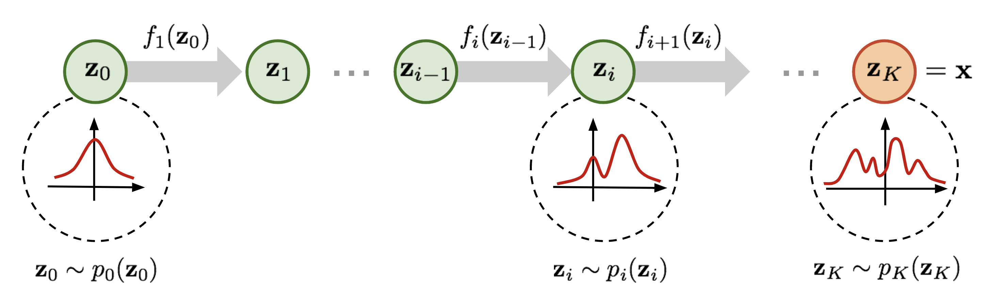
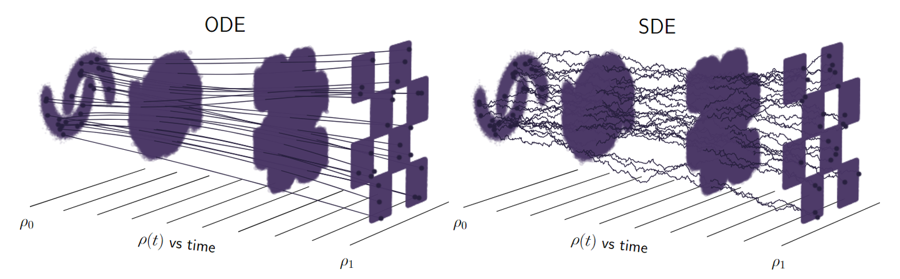
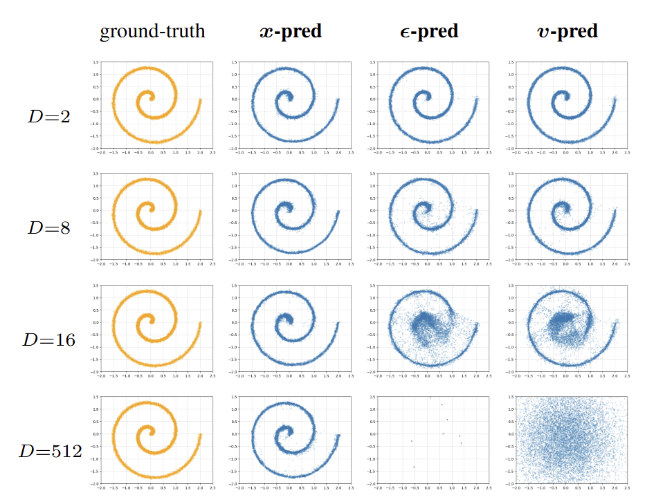
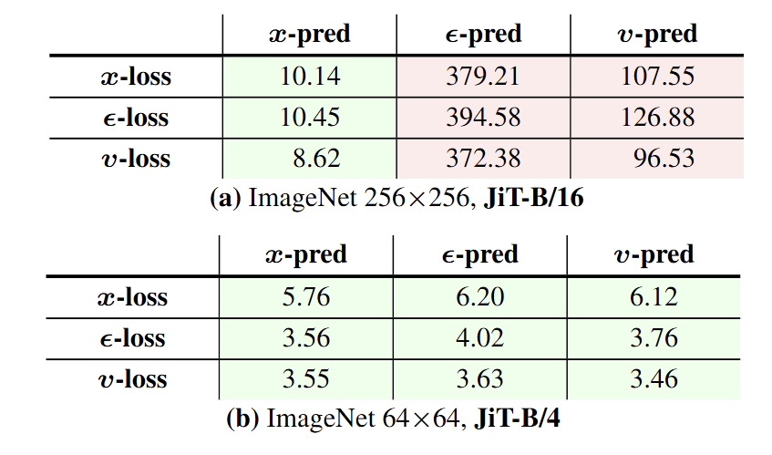
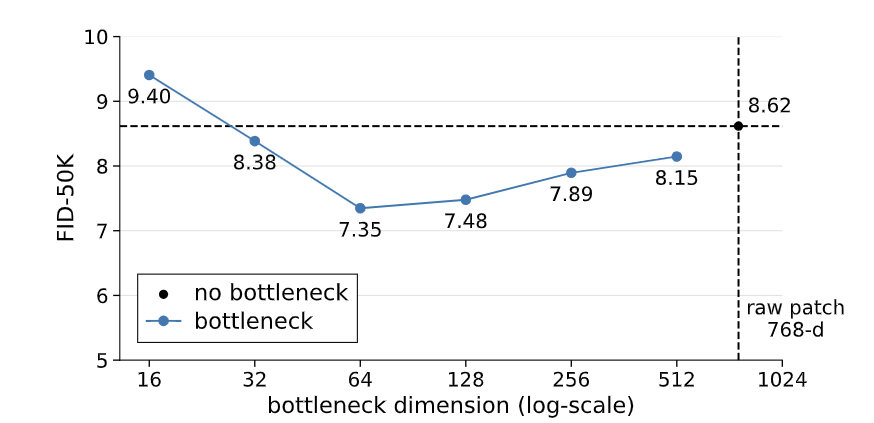
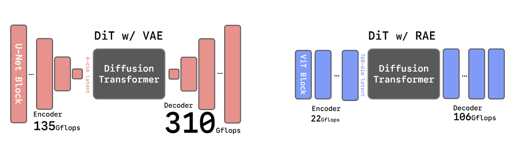
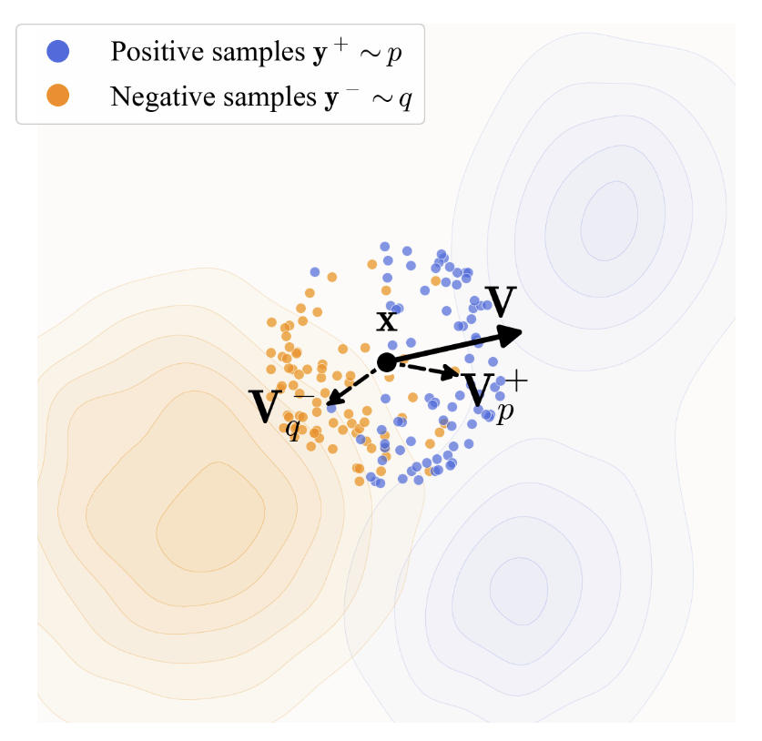
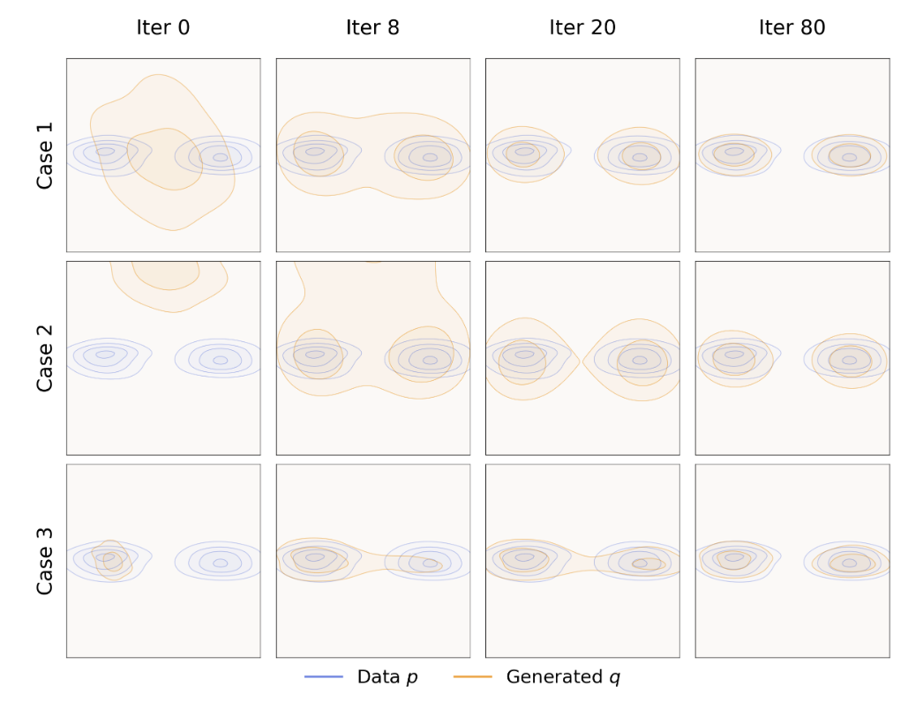

# Flow Matching


## 概率密度的变量变换定理
概率密度的变量变换定理可以通过累积分布函数的求导推导出来，核心思想是利用变换前后的概率分布等价性。以下是详细推导过程：

一维情形（$Y=g(X)$）

设 $g$ 可逆、可微，且 $X$ 的密度为 $f_X(x)$。由“概率质量守恒”可写成
$$
f_X(x)\,dx = f_Y(y)\,dy, \quad y=g(x).
$$
因此
$$
f_Y(y)=f_X(x)\left|\frac{dx}{dy}\right|,
$$
再代入 $x=g^{-1}(y)$，得到统一公式
$$
\boxed{f_Y(y)=f_X\big(g^{-1}(y)\big)\left|\frac{d}{dy}g^{-1}(y)\right|}.
$$

这个公式已经同时覆盖 $g$ 递增和递减两种情况，绝对值会自动处理符号问题。

多维推广

对可逆可微变换 $\mathbf{Y}=g(\mathbf{X})$，有
$$
f_{\mathbf{Y}}(\mathbf{y})
= f_{\mathbf{X}}\big(g^{-1}(\mathbf{y})\big)
\left|\det J_{g^{-1}}(\mathbf{y})\right|,
$$
其中 $J_{g^{-1}}(\mathbf{y})$ 是反函数的雅可比矩阵。

例子：高斯变量的线性变换

若
$$
X\sim\mathcal N(\mu,\sigma^2),\quad Z=aX+b,\ a\neq 0,
$$
则
$$
x=\frac{z-b}{a},\quad \left|\frac{dx}{dz}\right|=\frac{1}{|a|}.
$$
由变量变换公式：
$$
f_Z(z)=f_X\left(\frac{z-b}{a}\right)\frac{1}{|a|}
=\frac{1}{|a|\sigma\sqrt{2\pi}}
\exp\left(-\frac{(z-(a\mu+b))^2}{2a^2\sigma^2}\right).
$$
因此
$$
\boxed{Z\sim\mathcal N(a\mu+b,\ a^2\sigma^2)}.
$$

## 归一化流（Normalizing Flows）


归一化流（Normalizing Flows）是一种基于变量变换定理的生成模型，它通过一系列可逆变换将一个简单的基础分布（如标准高斯分布）逐步转换为复杂的目标分布。

设基础分布为 $ p_0(z_0) $，其中 $ z_0 \in \mathbb{R}^d $。定义一系列可逆变换：
$$
f_i: \mathbb{R}^d \to \mathbb{R}^d, \quad i = 1, \dots, K,
$$
每个  $f_i$  可逆且雅可比行列式易算。这些变换可复合为：
$$
f = f_K \circ f_{K-1} \circ \cdots \circ f_1
$$
通过变换得到随机变量：
$$
z_i = f_i(z_{i-1}), \quad x = z_K = f_K \circ f_{K-1} \circ \cdots \circ f_1(z_0)
$$
或者
$$
x_t = f_t \circ f_{t-1} \circ \cdots \circ f_1 (x_0) = \phi_t(x_0), \quad \phi_0(x_0) = x_0
$$

总结：归一化流通过可逆变换链，利用变量变换定理将简单分布逐步转换为复杂分布。

## 连续归一化流（Continuous Normalizing Flows, CNF）

Continuous Normalizing Flows (CNF) 是 Normalizing Flows 的一种扩展，它可以更好地建模复杂的概率分布。在传统的 Normalizing Flows 中，变换通常是通过一系列可逆的离散函数来定义的，而在CNF中，这种变换是连续的，这使得模型能够更加平滑地适应数据的分布，提高了模型的表达能力。CNF 过程通过常微分方程（ODE）来表示：

$$
\frac{d}{dt} \phi_t(x) = v_t(\phi_t(x))  \quad t \in [0, 1], \quad \phi_0(x) = x
$$
$\phi_t(x)$ 为 Flow Map 或者Transport Map，可以理解为整个分布在时间t下的映射轨迹或者路径。
$v_t(\phi_t(x))$ 为向量场，描述了空间中数据点在时刻 $t$ 下的变化速度(大小和方向)。
如果已知 $v_t(\phi_t(x))$ ，则可以通过求解 ODE 方程得到 初始噪声(标准高斯分布) $x_0$ 到 目标图像 $x_1$ 的映射路径 $\phi_t(x)$。  
采用欧拉方法来求解ODE，从初始值 $x_0$ 开始，使用下面的迭代公式来计算在后续时间点的近似值：
$$
x_{t+1} = x_t + \Delta t \cdot v_t(\phi_t(x_t)), \quad \Delta t \ll 1.
$$
设最大采样步数为 N，则步长 $\Delta t = {1}/{N}$，采样时刻 $t={i}/{N}$。


## 流匹配（Flow Matching）
流匹配的核心思想是：假定存在的某类映射路径的情况下，通过学习真实数据分布的变化得到向量场 $v_t(\phi_t(x))$ ，从而求解映射路径，最终确定真实数据的分布。具体来说，流匹配的目标是最小化数据分布与模型分布之间的差异，即：
$$
\mathcal{L}_{FM}(\theta) = \mathbb{E}_{t,p(x_t)} \left[ \| v_t(x_t, \theta) - u_t(x_t) \|^2 \right],
$$

其中 $\theta$ 是模型参数，$t$ 是时刻 取值范围 [0, 1]，$p(x_t)$ 是在时刻 $t$ 下的映射路径的数据分布，$x_0$ 是初始噪声（高斯分布），$x_1$ 是目标图像，$v_t(x_t, \theta)$ 是在时刻 $t$ 下的模型学习的向量场，$u_t(x_t)$ 是在时刻 $t$ 下的真实数据分布的向量场。

#### 条件向量场
现在前面的边缘向量场 $u_t(x_t)$ 是不知道的，如何构造一个已知的 $u_t(x_t)$ 让模型参考学习是接下来要解决的问题。在DDPM中遇到过类似的问题，是将 $p(x_t|x_{t-1})$ 转变成 $p(x_t|x_{t-1}, x_0)$（此时的$x_0$为真实图像）进行求解。类似的我们将 边缘向量场 $u_t(x_t)$ 也转变成条件向量场 $u_t(x_t|x_0, x_1)$ 查看其构造与原来的分布有何区别。

$$
\mathcal{L}_{CFM}(\theta) = \mathbb{E}_{t,p(x_t)} \left[ \| v_t(x_t, \theta) - u_t(x_t|x_0, x_1) \|^2 \right]
$$

其中
$$ u_t(x_t|x_0, x_1) = \frac{d}{dt} \phi_t(x_0,x_1) $$

在代码实践里常见的做法是选用最简单的 Rectified Flow 线性插值路径（也叫直线路径）：
$$
\phi_t(x_0,x_1) = (1-t)x_0 + tx_1, \quad t\in[0,1].
$$

此时
$$
x_t = \phi_t(x_0,x_1) = x_0 + t(x_1-x_0),
$$
对时间求导可得条件向量场
$$
u_t(x_t|x_0,x_1)=\frac{d}{dt}\phi_t(x_0,x_1)=x_1-x_0.
$$

这就是训练中把目标 $x_1-x_0$ 的来源：并不是“直接替换”边缘向量场，而是先选定路径，再由路径导数得到可监督目标。

进一步地，边缘向量场与条件向量场的关系可以写成
$$
u_t(x_t)=\mathbb{E}[u_t(x_t|x_0,x_1)\mid x_t]
=\mathbb{E}[x_1-x_0\mid x_t].
$$
因此使用 $(x_0,x_1,t)$ 采样并回归 $x_1-x_0$，等价于在该路径设定下学习边缘向量场的条件期望。
$$
\mathcal{L}_{CFM}(\theta) = \mathbb{E}_{t,p(x_t)} \left[ \| v_t(x_t, \theta) - (x_1 - x_0) \|^2 \right]
$$

### 采样公式

训练完成后，模型给出近似向量场 $v_\theta(x,t)$。采样时从噪声 $x_0\sim\mathcal{N}(0,I)$ 出发，求解如下 ODE：
$$
\frac{d}{dt}x_t = v_\theta(x_t,t), \quad t\in[0,1]
$$
积分到 $t=1$ 时得到生成样本 $x_1$。

在实现中通常使用欧拉法离散积分。设采样步数为 $N$，步长 $\Delta t=1/N$，时间网格为 $t_i=i/N$，则：
$$
x_{t_{i+1}} = x_{t_i} + \Delta t\, v_\theta(x_{t_i}, t_i), \quad i=0,1,\dots,N-1.
$$

和上面的训练目标对应起来看：若模型学到的向量场接近条件目标 $x_1-x_0$（直线路径下为常速度），则数值积分会把样本沿着学到的流线从噪声逐步推进到数据分布。

在理想情形（$v_\theta$ 与真实速度一致）下，连续解满足
$$
x_t = x_0 + \int_0^t v(x_s,s)\,ds,
$$
而在线性路径下有 $v(x_t,t)=x_1-x_0$，因此
$$
x_t = x_0 + t(x_1-x_0)
$$
这也说明了为什么训练时回归速度，采样时做 ODE 积分，两者在同一条逻辑链上是闭合的。

### 伪代码

训练伪代码（CFM / Rectified Flow，线性路径）：
```py
# model(x_t, t): predicts velocity field v_theta(x_t, t)
# x1: real image batch from dataloader

for x1 in dataloader:
  # 1) sample noise and time
  x0 = randn_like(x1)                  # x0 ~ N(0, I)
  t = rand_uniform([B, 1, 1, 1])       # t in [0, 1]

  # 2) construct linear interpolation path
  x_t = (1 - t) * x0 + t * x1

  # 3) conditional target velocity (for linear path)
  target_v = x1 - x0

  # 4) predict and optimize
  pred_v = model(x_t, t)
  loss = mse_loss(pred_v, target_v)

```

推理伪代码（欧拉法解 ODE）：
```py
# model(x_t, t): trained velocity model
# N: number of sampling steps

x = randn([B, C, H, W])   # x at t=0
dt = 1.0 / N

for i in range(N):
  t = i / N
  v = model(x, t)
  x = x + dt * v         # Euler update: x_{t+dt} = x_t + dt * v_theta(x_t, t)

x_gen = x                  # generated sample at t=1
```


## 扩展阅读
### JiT模型

[JiT：让去噪生成模型真正回归 "去噪"](https://zhuanlan.zhihu.com/p/1976481687618729389)

假设现在是有 $d$ 维数据，以流形的形式分布在 $D(d<D)$ 维空间中。

模型的 hidden dimension 是 256，当 $D=512$ 的时候，模型宽度不够了，对于 $\varepsilon, v $ 预测而言，都失败了。但是 $x$ 预测依旧有效。  
对于不同的loss的FID：

直接预测图像，loss还是用速度场比较好。

对于 Patch 维度是 768，作者把 linear patch embedding 替换成一对先降维后升维的线性层。第一层把 hidden dimension 降维 ，第二层再把维度升为 hidden dimension。发现在网络中引入先降维后升维的 Bottleneck 不但不会损失性能，反而更有帮助。  
作者认为，从表征学习的角度看，引入 Bottleneck 经常被用来促进学习低维表征。
训练伪代码：
```
# net(z, t): JiT network
# x: training batch

t = sample_t()
e = randn_like(x)

z = t * x + (1 - t) * e
v = (x - z) / (1 - t)

x_pred = net_fn(z, t)
v_pred = (x_pred - z) / (1 - t)

loss = l2_loss(v - v_pred)
```

推理伪代码：
```py
# z: current samples at t

x_pred = net_fn(z, t)
v_pred = (x_pred - z) / (1 - t)

z_next = z + (t_next - t) * v_pred
```
### RAE
[Representation Autoencoder：语义丰富的预训练 Encoder + 训练 Decoder](https://zhuanlan.zhihu.com/p/1961439090462404696)  
使用预训练的 Encoder (比如 DINOv2)，冻结参数，然后训练 Decoder。用这样得到的 Encoder + Decoder 替代 VAE，配合 Diffusion Model 完成图像生成任务。

- Decoder 的 token dimension 维度必须大于表征维度，这一点在JiT中也有类似体现。
- timestep shifting schedule 应该与有效数据维度 (token number × token dimension) 相关。对于 schedule $t_n \in [0,1]$  ，shifted timestep 定义为：$ t_m = \dfrac{\alpha t_n}{1+(\alpha-1)t_n}, \alpha=\sqrt{m/n}$  。其中，$\alpha$ 是 dimension-dependent scaling factor。作者遵循 SD3 的做法，使用 $n=4096$ 作为基础维度，$m$ 为 RAE 的有效数据维度。


###  Drifting Model (漂移模型)
原生一步推理模型  
[Drifting Model 漂移模型，一步生成式模型新范式](https://zhuanlan.zhihu.com/p/2004241203365946177)



 - 用模型生成作为负样本，目标作为正样本，计算漂移场;
 - 通过漂移场计算出漂移后的样本;
 - 对当前样本与漂移后的样本做loss。 

训练：
```py
# f: generator
# y_pos: [N_pos, D], data samples

e = randn([N, C]) # noise
x = f(e) # [N, D], generated samples
y_neg = x # reuse x as negatives

V = compute_V(x, y_pos, y_neg)
x_drifted = stopgrad(x + V)

loss = mse_loss(x - x_drifted)
```

计算漂移场：
```py
def compute_V(x, y_pos, y_neg, T):
  # x: [N, D]
  # y_pos: [N_pos, D]
  # y_neg: [N_neg, D]
  # T: temperature

  # compute pairwise distance
  dist_pos = cdist(x, y_pos)  # [N, N_pos]
  dist_neg = cdist(x, y_neg)  # [N, N_neg]
  
  # ignore self (if y_neg is x)
  dist_neg += eye(N) * 1e6

  # compute logits
  logit_pos = -dist_pos / T
  logit_neg = -dist_neg / T

  # concat for normalization
  logit = cat([logit_pos, logit_neg], dim=1)
  # normalize along both dimensions
  A_row = logit.softmax(dim=-1)
  A_col = logit.softmax(dim=-2)
  A = sqrt(A_row * A_col) 

  # back to [N, N_pos] and [N, N_neg]
  A_pos, A_neg = split(A, [N_pos,], dim=1)

  # compute the weights
  W_pos = A_pos  # [N, N_pos]
  W_neg = A_neg  # [N, N_neg]
  W_pos *= A_neg.sum(dim=1,keepdim=True)
  W_neg *= A_pos.sum(dim=1,keepdim=True)

  drift_pos = W_pos @ y_pos # [N_x, D]
  drift_neg = W_neg @ y_neg # [N_x, D]

  V = drift_pos - drift_neg
  return V 
```

=============================

rectified flow
meanflow, imeanflow
PixelDiT, JiT


Flow Matching (FM) 的统一视角理解：它本质上仍是「不断恢复 x0」
https://zhuanlan.zhihu.com/p/2004266706797879922

致AIGC新手--过一遍Flow Matching（Rectified flow） - Yeeseon的文章 - 知乎
https://zhuanlan.zhihu.com/p/1987159840682963062

生成扩散模型漫谈（三十）：从瞬时速度到平均速度 - 苏剑林的文章 - 知乎
https://zhuanlan.zhihu.com/p/1914623406890021596

Flow Matching与MeanFlow, Improved MeanFlow的数学基础 - 王云峰的文章 - 知乎
https://zhuanlan.zhihu.com/p/1980939388402811254


如何评价Kaiming组新工作，双向归一化流（BiFlow）的新框架？ - 叫我Alonzo就好了的回答 - 知乎
https://www.zhihu.com/question/1984359491957986604/answer/1986018640198394801


Scaling Rectified Flow Transformers for High-Resolution Image Synthesis  
https://stabilityai-public-packages.s3.us-west-2.amazonaws.com/Stable+Diffusion+3+Paper.pdf


