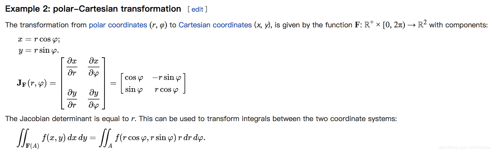

最优化理论与方法复习
https://blog.csdn.net/m0_62881487/category_12532279.html

### 雅可比矩阵和行列式（Jacobian）
在向量微积分学中，雅可比矩阵是向量对应的函数（就是多变量函数，多个变量可以理解为一个向量，因此多变量函数就是向量函数）的一阶偏微分以一定方式排列形成的矩阵。

假设某函数$R^n$从映到$R^m$， 其雅可比矩阵是从$R^n$到$R^m$的线性映射，其重要意义在于它表现了一个多变数向量函数的最佳线性逼近。因此，雅可比矩阵类似于单变数函数的导数。

这里的 x, y  表示函数

雅可比矩阵 $J_{f}(p)$ 就是函数f在n维空间某点p处的导数，它是一个线性映射（因为它是一个矩阵，矩阵本身代表着线性变换），它代表着函数f在点p处的最优线性逼近，也就是当x足够靠近点p时，我们有
$f(x) \approx f(p) + J_{f}(p) * (x-p)$

雅可比行列式: 代表经过变换后的空间与原空间的面积（2维）、体积（3维）等等的比例，也有人称缩放因子。

Jacobian Matrix 在运动学中的应用，如机械臂 有各个关节（旋转、平移）。