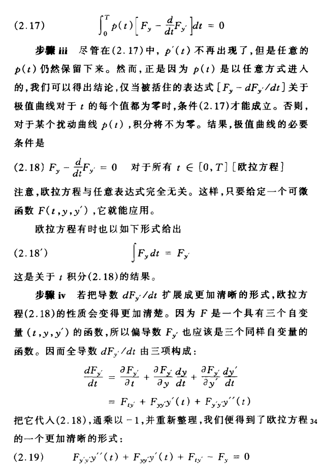

# 变分贝叶斯推断

## 变分原理
《动态最优化基础》中关于 泛函 和 变分 的推导。

Euler-Lagrange方程:  
$$F_y-\dfrac{d}{dt}F_{y^\prime}=0$$
或者
$$\dfrac{\partial F}{\partial y}-\dfrac{d}{dx}\dfrac{\partial F}{\partial y^\prime}=0$$

$F[t,y(t),y^\prime(t)]$ 表示“弧值”的一般表达式  
$F[t,y(t),y^\prime(t)]dt$ 表示t处的一段微小“弧值”  
$V[y]=\int_0^T F[t,y(t),y^\prime(t)]dt$ 表示“弧值之和”  

“弧值”的含义可以是 距离、时间、质量、概率 等等。

##### 例，连接两点间的最短曲线  
现在要找到“最短曲线”，意味着我们需要关于弧值为长度的一个泛函。  
两点间长度的一般表达式 $S=\sqrt{(x_1-x_2)^2+(y_1-y_2)^2}$  
曲线 $y(x)$ 上任意相邻的两点 $(x,y),(x+dx,y+dy)$ 微小“弧值”为:
$$
\begin{aligned}
F[x,y(x),y^\prime(x)]dx &=\sqrt{dx^2+dy^2} =\sqrt{1+(\dfrac{dy}{dx})^2}dx\\
&=\sqrt{1+{y^\prime}^2}dx
\end{aligned}
$$
设曲线的两端点为 $(a, m)$ 和 $(b, n)$ 则“弧值之和”
$$V[y]=\int_a^b{\sqrt{1+{y^\prime}^2}dx}, F=\sqrt{1+{y^\prime}^2}$$

由Euler-Lagrange方程: $\dfrac{\partial F}{\partial y}-\dfrac{d}{dx}\dfrac{\partial F}{\partial y^\prime}=0$  

F中不包含y, 有 $\dfrac{\partial F}{\partial y}=0$， $\dfrac{\partial F}{\partial y^\prime}=\dfrac{y^\prime}{\sqrt{1+{y^\prime}^2}}$ 代入欧拉方程：

$$\dfrac{d}{dx}\dfrac{\partial F}{\partial y^\prime}=\dfrac{d}{dx}(\dfrac{y^\prime}{\sqrt{1+{y^\prime}^2}})=0$$
所以 $\dfrac{y^\prime}{\sqrt{1+{y^\prime}^2}}=C$常数，求得 $y^\prime=C$, 然后对 $y^\prime$ 求积分有：
$$y=kx+c$$

## 变分贝叶斯推断
变分推理与MCMC的比较。统计学家什么时候应该使用MCMC，什么时候应该使用变分推理?我们将提供一些指导。MCMC方法往往比变分推理的计算量更大，但它们也提供了从目标密度产生(渐近的)精确样本的保证(Robert和Casella, 2004)。变分推理没有这样的保证——它只能找到接近目标的密度——但往往比MCMC更快。因为它依赖于优化，变分推理很容易利用随机优化等方法(Robbins和Monro, 1951;Kushner和Yin, 1997)和分布式优化尽管一些MCMC方法也可以利用这些创新(Welling和Teh, 2011;Ahmed et al.，2012)。因此，变分推理适用于大型数据集和我们想要快速探索许多模型的场景;MCMC适用于较小的数据集和我们愿意为更精确的样本支付更大的计算成本的场景。例如，我们可能会在这样的环境中使用MCMC:我们花了20年的时间收集一个小而昂贵的数据集，我们确信我们的模型是合适的，并且我们需要精确的推断。当将文本的概率模型拟合到10亿个文本文档时，我们可能会使用变分推理，并且这些推理将用于向大量用户提供搜索结果。

图(a)表示总体均值问题的图形模型，方形节点表示观察到变量。图(b)真实联合分布 P 与变分贝叶斯近似分布 Q 。 

变分推理的目标是近似潜在变量(latent variables)在观测变量（observed variables）下的条件概率。解决该问题，需要使用优化方法。在变分推断中，需要使用到的一个重要理论，是平均场理论.
#### 平均场理论  
来源于物理学，是一种研究复杂多体问题的方法，将数量巨大的互相作用的多体问题转化成每一个粒子处在一种弱周期场中的单体问题。  
对于概率模型：  
$$P(x_1,x_2,x_3,\cdots,x_n)=P(x_1)P(x_2|x_1)P(x_3|x_2,x_1) \cdots P(x_n|x_{n-1},\cdots,x_1)$$
可以找到一个近似模型：
$$Q(x_1,x_2,\cdots,x_n)=Q(x_1)Q(x_2)\cdots Q(x_n)$$
使得 Q 与 P 尽可能相似。

在贝叶斯模型中, 通常需要从已知的样本中推测模型的参数，即 后验概率 $P(Z|X)$, 然而 直接计算出$P(Z|X)$通常比较困难。我们可以利用平均场理论，通过模型 $Q(Z)=\prod_i Q(z_i)$ 来近似代替 $P(Z|X)$。  
衡量两个概率密度函数(PDF)的差异，可以利用KL散度(KL-Divergence)。
$$KL(Q(Z)||P(Z|X))=\int Q(Z) log \dfrac{Q(Z)}{P(Z|X)}dZ$$  
这里 $KL(Q(Z)||P(Z|X))$ 即是关于 Q 的泛函。为使 Q 和 P 尽可能相似，则需要KL最小化。
求解KL最小化下，Q 的概率密度函数，即变分问题。其中 Q 的累积分布函数(CDF) $\int Q(Z)dz =1$ 。
$$
KL(Q(Z)||P(Z|X))=\int Q(Z) log \dfrac{Q(Z)}{P(Z|X)}dZ \\
\overset{\text{log取倒数}}{=}-\int Q(Z) log \dfrac{P(Z|X)}{Q(Z)}dZ \\
\overset{\text{上下乘P(Z)}}{=}-\int Q(Z) log \dfrac{P(Z,X)}{Q(Z)P(X)}dZ \\
\overset{\text{log分式展开}}{=}\int Q(Z) [logQ(Z)+logP(Z)]dZ - \int Q(Z)logP(Z,X)dZ \\
\overset{\text{P(X)为常数,Q累积分布为1}}{=}logP(X)+\int Q(Z) logP(Z)dZ - \int Q(Z)logP(Z,X)dZ \\
$$
令$L(Q)=-[\int Q(Z) logP(Z)dZ - \int Q(Z)logP(Z,X)dZ]$, 则有 
$$
KL(Q(Z)||P(Z|X))=logP(X)-L(Q) \geq 0 (吉布斯不等式)\\
logP(X) \geq L(Q)
$$  
$logP(X)$的下界$L(Q)$, 称为 ELOB (Evidence Lower Bound), 其中$logP(X)$为常数，通过最大化ELOB $L(Q)$ 使得KL最小化。 求解最大化$L(Q)$的过程同样也是一个变分问题。

把平均场定理：$Q(Z)=\prod_i Q(z_i)$ 代入 $L(Q)$ 中得到：  
$$
L(Q)=\prod_{i;i\neq j}H(Q(z_i))-KL(Q(z_j)||Q^*(z_j))-C
$$
 
其中$Q^*(z_j)=\dfrac{exp(E_{i\neq j}[logP(Z,X)])}{\int exp(E_{i\neq j}[logP(Z,X)])}$, 归一化项 $\int exp(E_{i\neq j}[logP(Z,X)])$ 使得整体的$Q^*(z_j)$ PDF积分为1。详细推理过程参考[变分贝叶斯推断(Variational Bayes Inference)简介](https://blog.csdn.net/aws3217150/article/details/57072827)  

因为 信息熵$\prod_{i;i\neq j}H(Q(z_i))\geq 0, 且 KL(Q(z_j)||Q^*(z_j)) \geq 0$  
所以 最大化$L(Q)$只需令$KL(Q(z_j)||Q^*(z_j))=0$, 则有：  
$$Q(z_j) = Q^*(z_j)$$  
至此，变分贝叶斯推断的通用公式求法，如下：  
- 循环直到收敛:
  - 对于每个$Q(z_j)$:
  - 令$Q(z_j) = Q^*(z_j)$

虽然从理论上推导了变分推断的框架算法，但是对于不同模型，我们必须手动推导，简要来说，推导变分贝叶斯模型一般分为四个步骤：

- 确定好研究模型各个参数的的共轭先验分布如果想做full bayes model

- 写出研究模型的联合分布P(Z,X)

- 根据联合分布确定变分分布的形式Q(Z)

- 对于每个变分因子Q(zj)求出P(Z,X)关于不包含变量zj

思考：  
模型构建中，若$Q(z_j)$参数过于简单，会使得信息熵$H(Q(z_i))$过小，从而$L(Q)$过小。  
若$Q(z_j)$参数过于复杂 或者 设置了错误的参数，会使得$KL(Q(z_j)||Q^*(z_j))$难以拟合，KL太大也会影响到$L(Q)$。 

共轭先验分布：设是总体分布中的参数(或参数向量)，是的先验密度函数，假如由抽样信息算得的后验密度函数与有相同的函数形式，则称是的(自然)共轭先验分布。

参考文章：  
《动态最优化基础》蒋中一  

https://arxiv.org/pdf/1601.00670v9 ⭐⭐⭐

[A Tutorial on Variational Bayesian Inference](https://web-archive.southampton.ac.uk/www.orchid.ac.uk/eprints/40/1/fox_vbtut.pdf)

[变分贝叶斯推断(Variational Bayes Inference)简介](https://blog.csdn.net/aws3217150/article/details/57072827) ⭐  

[变分推断中的ELBO(证据下界)](https://qianyang-hfut.blog.csdn.net/article/details/93074519) ⭐⭐

[浅谈变分原理](https://zhuanlan.zhihu.com/p/139018146)

[变分法笔记(1)——古典变分问题的例子](https://zhuanlan.zhihu.com/p/356909790)

[《现代概率论》学习笔记](https://www.cnblogs.com/lixddd/category/2128479.html)
