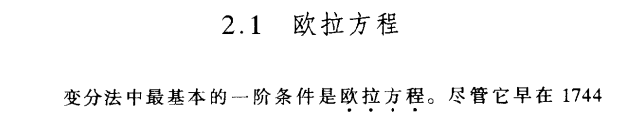

# 变分贝叶斯推断

## 变分原理
下面是 《动态最优化基础》中关于 泛函 和 变分 的推导，比直接从符号定义出发的推导容易理解一些。

Euler-Lagrange方程:  
$$F_y-\dfrac{d}{dt}F_{y^\prime}=0$$
或者
$$\dfrac{\partial F}{\partial y}-\dfrac{d}{dx}\dfrac{\partial F}{\partial y^\prime}=0$$

$F[t,y(t),y^\prime(t)]$ 表示“弧值”的一般表达式  
$F[t,y(t),y^\prime(t)]dt$ 表示t处的一段微小“弧值”  
$V[y]=\int_0^T F[t,y(t),y^\prime(t)]dt$ 表示“弧值之和”  

“弧值”的含义可以是 距离、时间、质量、概率 等等。

例，连接两点间的最短曲线  
现在要找到“最短曲线”，意味着我们需要关于弧值为长度的一个泛函。  
两点间长度的一般表达式 $S=\sqrt{(x_1-x_2)^2+(y_1-y_2)^2}$  
曲线 $y(x)$ 上任意相邻的两点 $(x,y),(x+dx,y+dy)$ 微小“弧值”为:
$$
\begin{aligned}
F[x,y(x),y^\prime(x)]dx &=\sqrt{dx^2+dy^2} =\sqrt{1+(\dfrac{dy}{dx})^2}dx\\
&=\sqrt{1+{y^\prime}^2}dx
\end{aligned}
$$
设曲线的两端点为 $(a, m)$ 和 $(b, n)$ 则“弧值之和”
$$V[y]=\int_a^b{\sqrt{1+{y^\prime}^2}dx}, F=\sqrt{1+{y^\prime}^2}$$

由Euler-Lagrange方程: $\dfrac{\partial F}{\partial y}-\dfrac{d}{dx}\dfrac{\partial F}{\partial y^\prime}=0$  

F中不包含y, 有 $\dfrac{\partial F}{\partial y}=0$， $\dfrac{\partial F}{\partial y^\prime}=\dfrac{y^\prime}{\sqrt{1+{y^\prime}^2}}$ 代入欧拉方程：

$$\dfrac{d}{dx}\dfrac{\partial F}{\partial y^\prime}=\dfrac{d}{dx}(\dfrac{y^\prime}{\sqrt{1+{y^\prime}^2}})=0$$
所以 $\dfrac{y^\prime}{\sqrt{1+{y^\prime}^2}}=C$常数，求得 $y^\prime=C$, 然后对 $y^\prime$ 求积分有：
$$y=kx+c$$

## 变分贝叶斯推断

参考文章：  
《动态最优化基础》蒋中一

[变分贝叶斯推断(Variational Bayes Inference)简介](https://blog.csdn.net/aws3217150/article/details/57072827)

[变分推断中的ELBO(证据下界)](https://qianyang-hfut.blog.csdn.net/article/details/93074519)

[浅谈变分原理](https://zhuanlan.zhihu.com/p/139018146)

[变分法笔记(1)——古典变分问题的例子](https://zhuanlan.zhihu.com/p/356909790)

[《现代概率论》学习笔记](https://www.cnblogs.com/lixddd/category/2128479.html)
